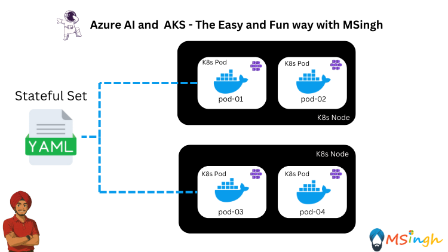

## StatefulSet Deployments 



### Lab Overview
In this lab, you'll deploy a stateful application using a StatefulSet in Azure Kubernetes Service (AKS). A StatefulSet is used for applications that require stable, unique network identifiers and stable storage. This is particularly useful for applications like databases or distributed systems.

>**Note:**
> In this lab, we will be using the same application as the one in the `acr_to_aks.md` lab, but this time we will deploy it as a StatefulSet. If you haven't completed the `acr_to_aks.md` lab, please do so first. The steps for running the application locally are also the same as in that lab, so you can refer to it for guidance.

### Creating a StatefulSet Manifest
First, create a directory called `manifests` in the root of the repository to store the manifest files:
```bash
mkdir manifests
```

For creating a `StatefulSet` resource, we will need to create a service to provide stable network identities for the Pods. This service is often referred to as a "headless" service.

>**Why Headless Service?**
> A headless service allows you to create a service without a cluster IP, which means that the DNS records will point directly to the Pods. This is useful for StatefulSets where each Pod needs a stable network identity.

Create a headless service manifest file named `aoaichatapp-headless.yaml` in the `manifests` directory with the following content:

```yaml
apiVersion: v1
kind: Service
metadata:
  name: aoaichatapp-headless
spec:
  ports:
  - port: 80
    name: http
  clusterIP: None
  selector:
    app: aoaichatapp
```

Next, create a file named `aoaichatapp-statefulset.yaml` in the `manifests` directory with the following content:

```yaml
apiVersion: apps/v1
kind: StatefulSet
metadata:
  name: aoaichatapp
spec:
  serviceName: "aoaichatapp-headless"
  replicas: 3
  selector:
    matchLabels:
      app: aoaichatapp
  template:
    metadata:
      labels:
        app: aoaichatapp
    spec:
      containers:
      - name: aoaichatapp
        image: $ACR_NAME.azurecr.io/aoaichatapp:latest
        ports:
        - containerPort: 80
```

### Deploying the StatefulSet to AKS
Now that we have the manifest files ready, we can deploy the StatefulSet to AKS. Run the following command:

```bash
kubectl apply -f manifests/aoaichatapp-headless.yaml
kubectl apply -f manifests/aoaichatapp-statefulset.yaml
```
### Verify the Deployment
You can verify that the StatefulSet has been created and the Pods are running by executing the following commands:

```bash
kubectl get statefulsets
kubectl get pods
```

### Resolving Pod DNS
the DNS names for the Pods in a StatefulSet follow a specific pattern: `<POD_NAME>.<SERVICE_NAME>.<NAMESPACE>.svc.cluster.local`. For example, if you have a Pod named `aoaichatapp-0`, it can be accessed at `aoaichatapp-0.aoaichatapp-headless.default.svc.cluster.local`.

We will now create a temporary debug pod to test the DNS resolution:

```bash
kubectl run dns-debug --image=busybox:1.35 --rm -it --restart=Never -- sh
```

Inside the debug pod, you can use the `nslookup` command to check the DNS resolution:

```bash
nslookup aoaichatapp-0.aoaichatapp-headless.default.svc.cluster.local
```
This should return the IP address of the Pod `aoaichatapp-0`.

```bash
nslookup aoaichatapp-1.aoaichatapp-headless.default.svc.cluster.local
```
This should return the IP address of the Pod `aoaichatapp-1`.

>**Note:** the DNS response looks like this:
```
Server:         10.0.0.10
Address:        10.0.0.10:53

Name:   aoaichatapp-0.aoaichatapp-headless.default.svc.cluster.local
Address: 10.244.0.25
```

Explanation:
- **Server**: The DNS server that resolved the query. (in this case, it is the CoreDNS service in AKS)
- **Address**: The IP address and the port combination of the DNS server.
- **Name**: The fully qualified domain name (FQDN) of the Pod.
- **Address**: The IP address of the Pod.

>**Note:** To exit the debug pod, type `exit`.

### Scaling the StatefulSet
To scale the StatefulSet, you can use the `kubectl scale` command. For example, to scale the StatefulSet to 5 replicas, run:

```bash
kubectl scale statefulset aoaichatapp --replicas=5
```

You will note that the Pods will be created with stable network identities, which can be verified by checking the Pod names:

```bash
kubectl get pods -l app=aoaichatapp
```

### Scaling Down the StatefulSet
To scale down the StatefulSet, you can use the same `kubectl scale` command. For example, to scale it back down to 3 replicas, run:

```bash
kubectl scale statefulset aoaichatapp --replicas=3
```
This will remove the Pods in reverse order, ensuring that the stable network identities are maintained for the remaining Pods.

