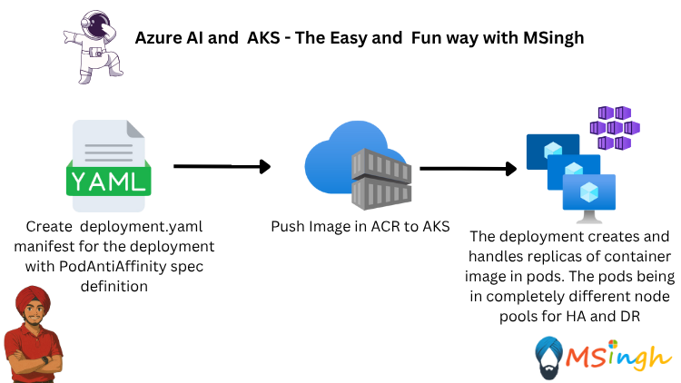
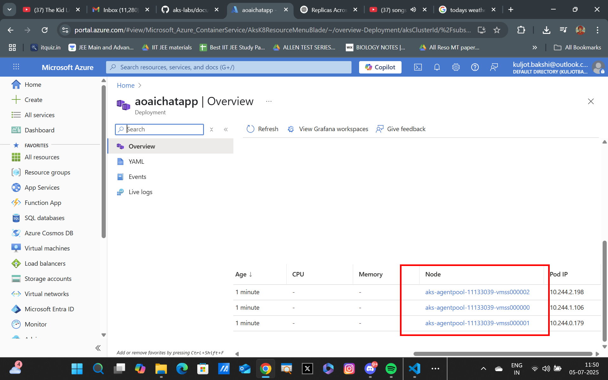

## Pod Anti-Affinity 
Pod anti-affinity is a Kubernetes feature that allows you to specify rules for how Pods should not be scheduled on the same node as other Pods. This is useful for ensuring high availability and fault tolerance by preventing Pods from being co-located on the same node, which could lead to a single point of failure.

### Delete Existing Deployment
first of all delete the deployments that have already been created:
```bash
kubectl delete deployment aoaichatapp
```

check that the deployment has been deleted:
```bash
kubectl get deployments
```

```bash
kubectl gets pods
```

### Create a Manifest file with Pod Anti-Affinity
Run the following command to create a templated manifest file with ACR integration

```bash
kubectl create deployment aoaichatapp \
--image=$ACR_NAME.azurecr.io/aoaichatapp:latest \
--port=80 \
--dry-run=client \
--output yaml > manifests/aoaichatapp-deployment.yaml
```

!Note: Make sure to replace `$ACR_NAME` with your actual Azure Container Registry name.

!Note: Make sure you have the `manifests` directory created in your current working directory before running the command. If it doesn't exist, you can create it using the following command:
```bash
mkdir manifests
```

### Add Pod Anti-Affinity Rules

Replace the content of `manifests/aoaichatapp-deployment.yaml` with the following:

```yaml
apiVersion: apps/v1
kind: Deployment
metadata:
  creationTimestamp: null
  labels:
    app: aoaichatapp
  name: aoaichatapp
spec:
  replicas: 3
  selector:
    matchLabels:
      app: aoaichatapp
  strategy: {}
  template:
    metadata:
      creationTimestamp: null
      labels:
        app: aoaichatapp
    spec:
      affinity: 
       podAntiAffinity:
        requiredDuringSchedulingIgnoredDuringExecution:
        - labelSelector:
            matchExpressions:
             - key: app
               operator: In
               values:
               - aoaichatapp
          topologyKey: kubernetes.io/hostname
         
      containers:
      - image: $ACR_NAME.azurecr.io/aoaichatapp:latest
        name: aoaichatapp
        ports:
        - containerPort: 80
        resources: {}
status: {}
```

**ℹ️ Note:**  Make sure to replace `$ACR_NAME` with your actual Azure Container Registry name in the `image` field.

### Apply the Manifest File
then apply the manifest file to create the deployment with pod anti-affinity rules:

```bash
kubectl apply -f manifests/aoaichatapp-deployment.yaml
```
### Verify the Deployment
Check the status of the deployment to ensure it has been created successfully:

```bash
kubectl get deployments
```

Check the status of the pods to ensure they are running:

```bash
kubectl get pods
```
### Verify Pod Anti-Affinity
Go to Azure Portal and navigate to your AKS cluster. Check the nodes and pods to verify that the pods are not scheduled on the same node.



### Cleanup
To clean up the resources created during this lab, you can delete the deployment and any associated resources:

```bash
kubectl delete deployment aoaichatapp
```
### Summary
In this lab, you learned how to implement pod anti-affinity in Kubernetes to ensure that your application pods are not scheduled on the same node. This helps improve the availability and fault tolerance of your application by preventing a single point of failure. You also verified the deployment and pod status in both the command line and Azure Portal.


