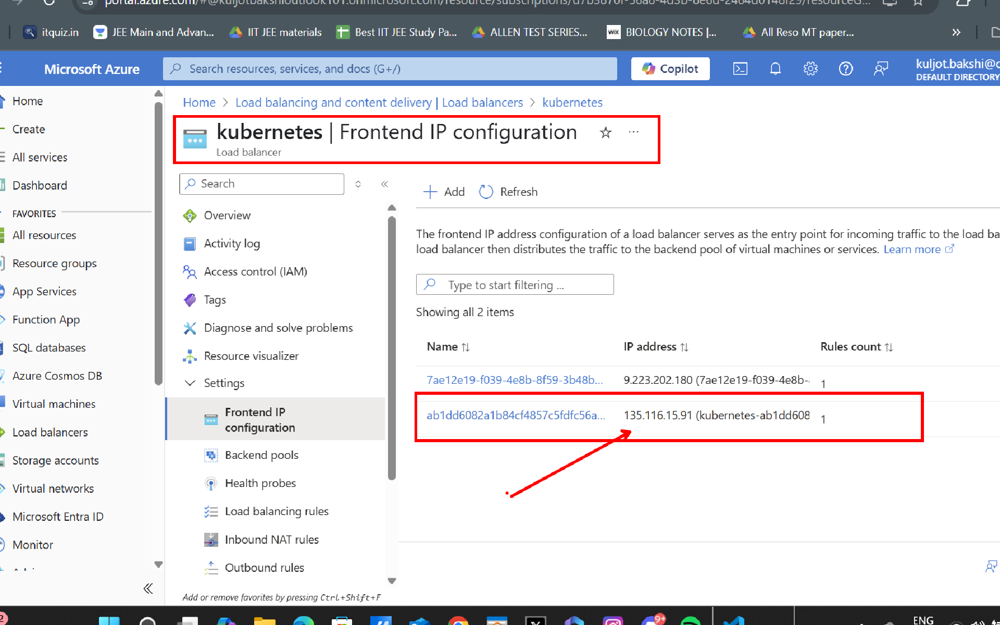
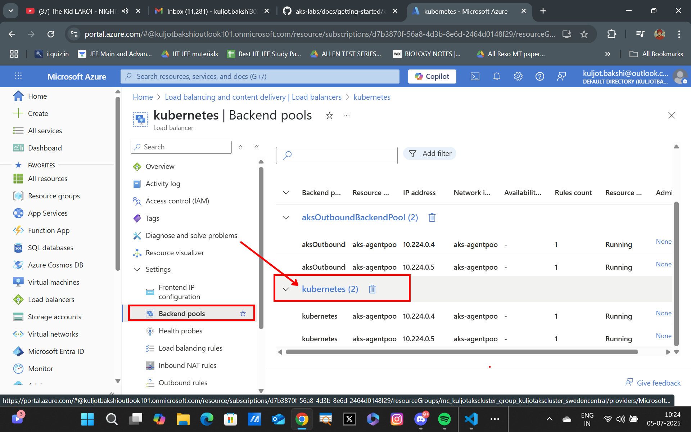

## Exposing ACR Image to the Internet via Azure Load Balancer

Run the following command to expose the aoaichatapp Pod using a Service resource and make sure to set the selector to match the Pod label of the aoaichatapp Pod.

```bash
kubectl expose deploy/aoaichatapp --selector app=aoaichatapp --name aoaichatapp-loadbalancer --type LoadBalancer
```

The kubectl expose command creates a Service resource that acts as a load balancer for the nginx-blue Pod. The --selector flag specifies the label selector to use to match the Pod, and the --name flag specifies the name of the Service resource. The --type LoadBalancer flag specifies that the Service resource should be of type LoadBalancer, which will create an external Azure Load Balancer to route external traffic to the Service.

Run the following command to get the Service resource and see the details.
```bash
kubectl get svc aoaichatapp-loadbalancer
```

Wait until the EXTERNAL-IP is assigned. This may take a few minutes.

Once the EXTERNAL-IP is assigned, you can run the following command to port-forward the Service resource to your local machine.
```
echo "http://$(kubectl get svc aoaichatapp-loadbalancer --output jsonpath='{.status.loadBalancer.ingress[0].ip}')"
```

Click the link in your terminal to open the Azure OpenAI Chat App in your Browser. You should see the AOAI Chat App running in your browser.

You can also go to Azure Portal and navigate to the Load Balancer resource to see the details of the Load Balancer and the associated Public IP address.


---

---
Note the Backend Pool.


---


