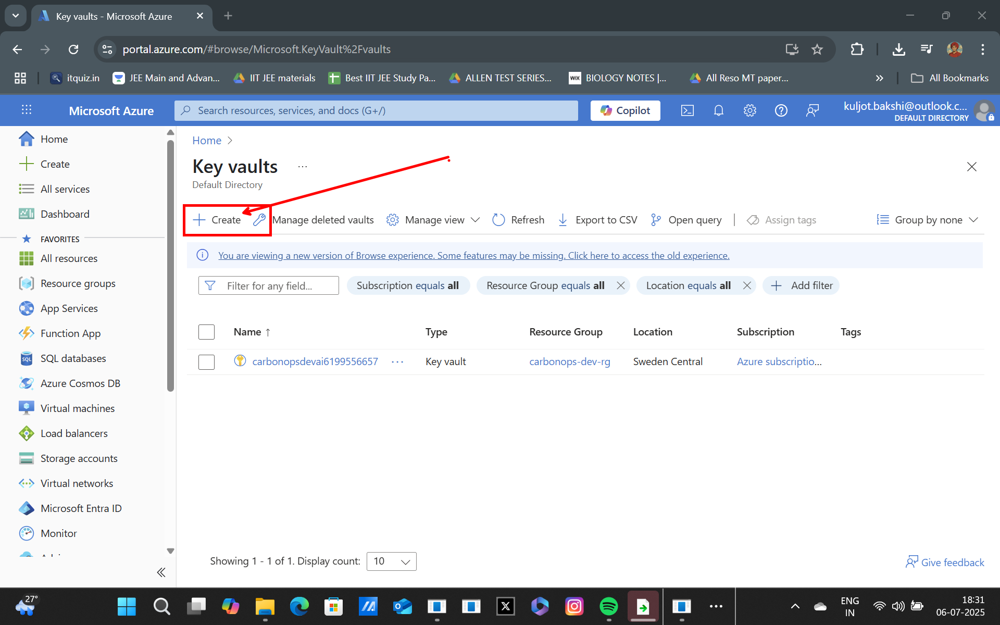
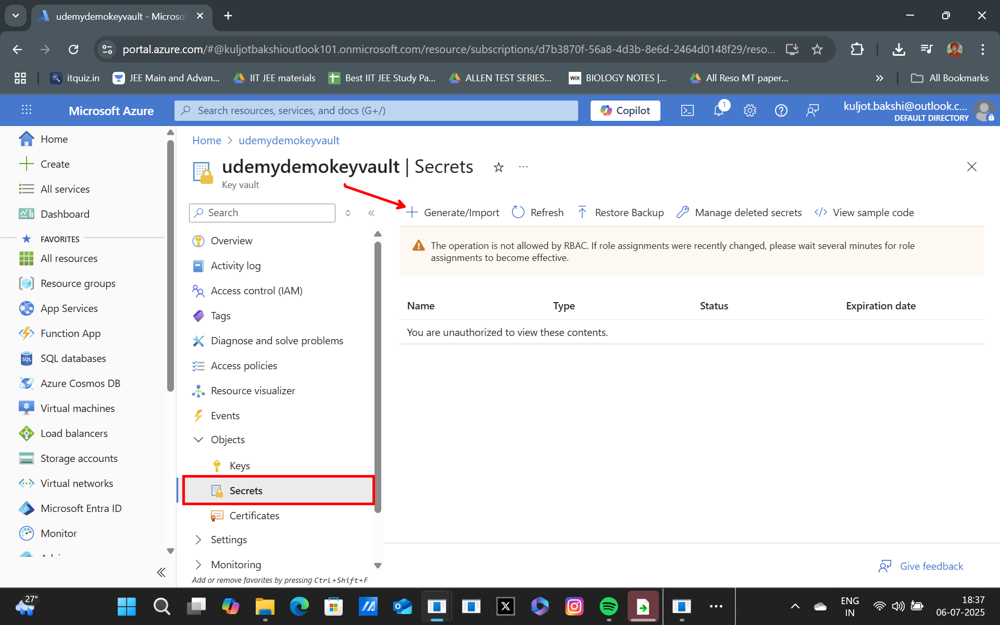
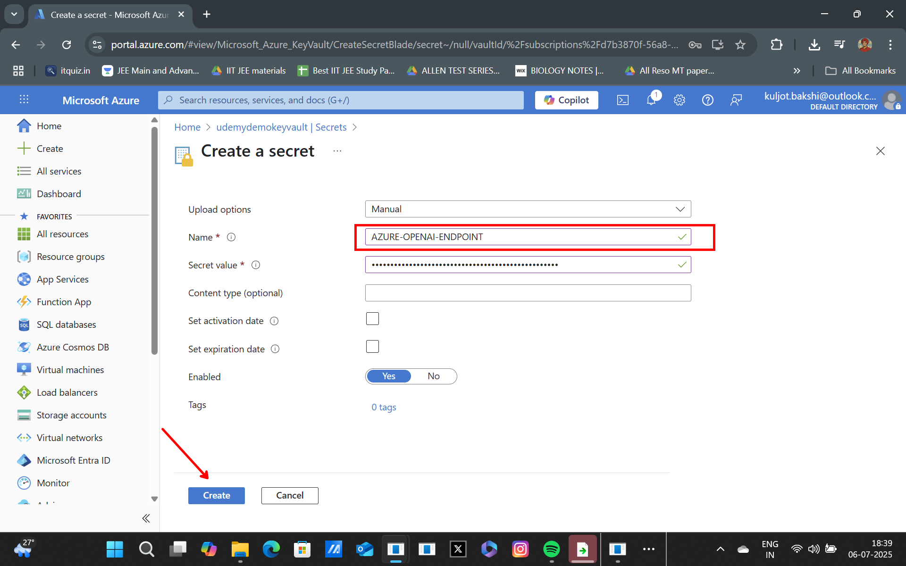
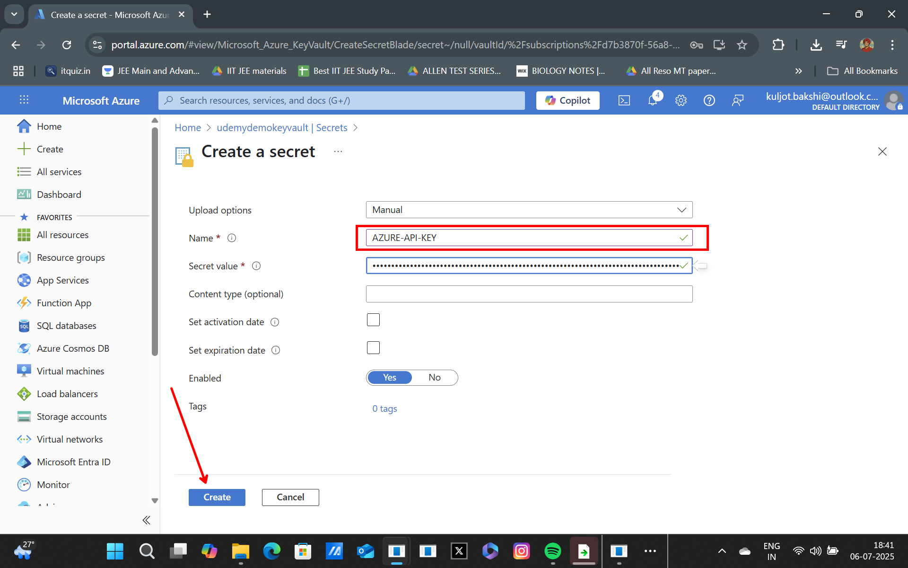
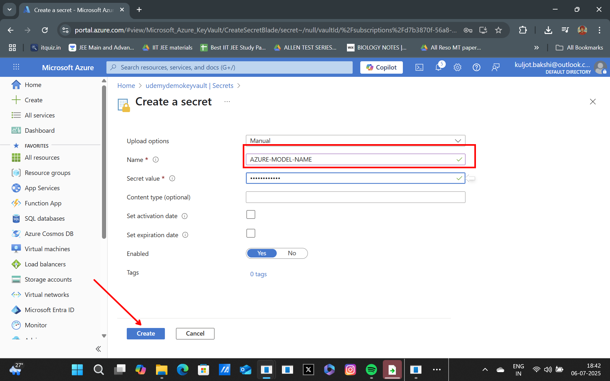
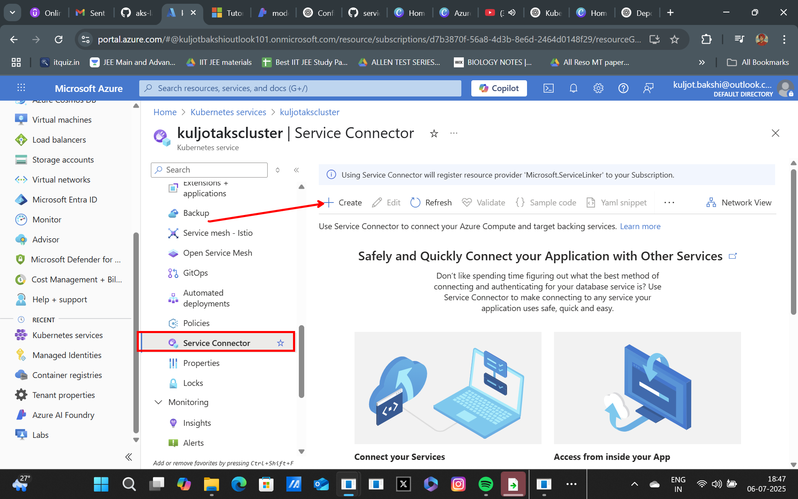
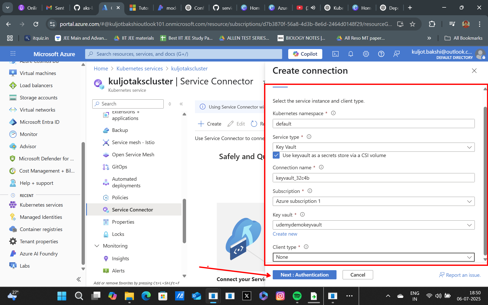
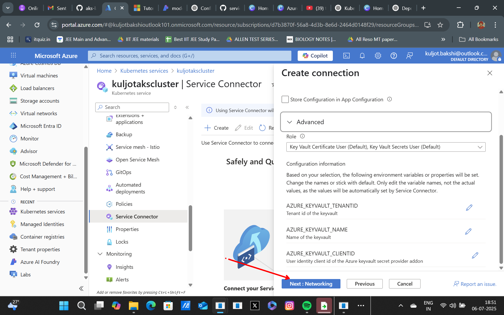
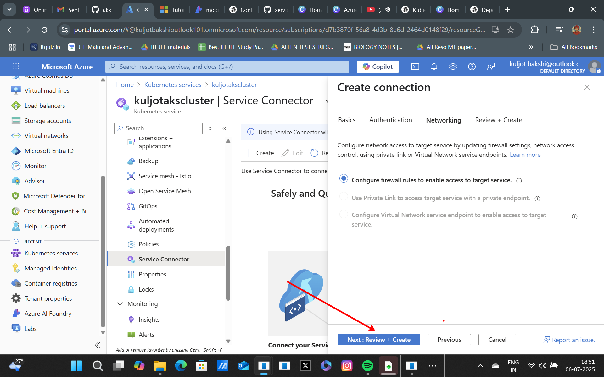

## Azure Key Vault and AKS - Security at its Peak!

Azure Key Vault is a cloud service that provides a secure store for secrets, keys, and certificates. It is designed to help safeguard cryptographic keys and secrets used by cloud applications and services. When integrated with Azure Kubernetes Service (AKS), it enhances the security of your applications by managing sensitive information securely.

### Overview of what we will cover:
Till now we saw how we could create a configMap and a secret store in AKS for storing sensitive information. All that is good for `dev` or `test` environments.

You need something more secure and efficient for `prod` or `live` environments. This is where `Azure Key Vault` comes in. In this lab, we will explore how to use Azure Key Vault to store secrets and access them securely in an AKS cluster.

### Create an Azure Key Vault Resource

1) Navigate to the Azure Portal and create a new Key Vault resource.

2) Fill in the required details such as Subscription, Resource Group, Key Vault Name, and Region. Ensure that the Key Vault name is globally unique.

3) We will now create three secrets in the Key Vault:
    - `AZURE-OPENAI-ENDPOINT`
    - `AZURE-API-KEY`
    - `AZURE-MODEL-NAME`

4) In the Key Vault, go to `Secrets` in the `Objects` tab and click on `+ Generate/Import`.

5) Create the secrets one by one:
    - For `AZURE-OPENAI-ENDPOINT`, enter the value for your Azure OpenAI endpoint.
    - For `AZURE-API-KEY`, enter your Azure API key.
    - For `AZURE-MODEL-NAME`, enter the model name you want to use.

---

---

---

### Create a service connection in AKS with Service Connector

1) Open your Kubernetes service in the Azure portal and select Service Connector from the left menu.

2) Select Create and fill in the settings as shown below. Leave the other settings with their default values.

| Setting               | Choice                | Description                                                                                   |
|-----------------------|----------------------|-----------------------------------------------------------------------------------------------|
| Kubernetes namespace  | default              | The namespace where you need the connection in the cluster.                                   |
| Service type          | Key Vault (enable CSI)| Choose Key Vault as the target service type and check the option to enable CSI.               |
| Connection name       | keyvault_conn        | Use the connection name provided by Service Connector or choose your own connection name.      |
| Subscription          | <MySubscription>     | The subscription for your Azure Key Vault target service.                                     |
| Key vault             | <MyKeyVault>         | The target key vault you want to connect to.                                                  |
| Client type           | None                  | The code language or framework you use to connect to the target

---

---

---

