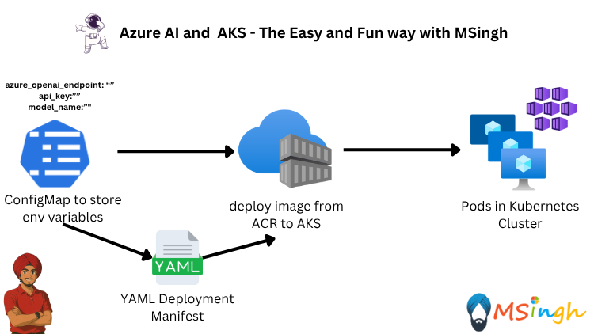

### Understand ConfigMaps
Almost every application has settings that can be configured. These settings are typically stored in a configuration file or environment variables. In Kubernetes, you can use ConfigMaps to store these settings and make them available to the application.

You can create a ConfigMap resource from a file or from literal values. The ConfigMap resource can then be mounted as a volume in the Pod or used as environment variables in the container.

### Create a ConfigMap

First we will set the variables in bash shell to use later in the ConfigMap creation command. Make sure to replace the placeholders with your Azure OpenAI endpoint, API key, and model name.

```bash
export AZURE_OPENAI_ENDPOINT="your-azure-openai-endpoint"
```


```bash
export AZURE_API_KEY="your-azure-api-key"
```

```bash
export AZURE_MODEL_NAME="your-azure-model-name"
```

Create a ConfigMap resource for the `aoaipythonapp` application.
```bash
kubectl create configmap aoaipythonapp-configs \
--from-literal=AZURE_API_URL=$AZURE_OPENAI_ENDPOINT \
--from-literal=AZURE_API_KEY=$AZURE_API_KEY \
--from-literal=AZURE_MODEL_NAME=$AZURE_MODEL_NAME
```

Replace the placeholders with your Azure OpenAI endpoint, API key, and model name. You can find these values in the Azure Portal under the Azure OpenAI or the Azure AI Foundry Resource.

### Verify and View the Resources of the ConfigMap
To view the contents of the ConfigMap resource, you can run the following command.
```bash
kubectl get configmap aoaipythonapp-configs -o yaml
```

This command retrieves the ConfigMap resource and outputs it in YAML format, allowing you to see the key-value pairs stored in the ConfigMap.

### Use the ConfigMap in the Deployment
Since we have modified the `aoaipythonapp` application code, we will have to create a new image locally and push it to the Azure Container Registry (ACR) before we can deploy it to the AKS cluster with the environment variables from the ConfigMap. Make sure you are in the `aoaipythonapp` directory.

```bash
docker build -t aoaipythonapp:latest .
```

Now we will run the application locally first by passing in the environment variables manually during runtime. This is a good way to test the application locally before deploying it to the AKS cluster.

```bash
docker run -p 8000:5000 \
-e AZURE_API_URL=$AZURE_OPENAI_ENDPOINT \
-e AZURE_API_KEY=$AZURE_API_KEY \
-e AZURE_MODEL_NAME=$AZURE_MODEL_NAME \
aoaipythonapp:latest
```

You can test the application by making a sample CURL request to the application running on port 8000. Open a new terminal window and run the following command:
```bash
curl -X POST http://localhost:8000/chat \
  -H "Content-Type: application/json" \
  -d '{"message": "Hello, can you help me with Azure OpenAI?"}'
```

Now that the application is containerized and confirmed to be running locally, we can push it to a container registry. In this case, we will use Azure Container Registry (ACR).

Run the following commands to get the name of the ACR and login.
```bash
az acr login --name $ACR_NAME
```
Make sure to replace `$ACR_NAME` with the name of your Azure Container Registry.

Run the following command to tag the container image with the ACR registry name.
```bash
docker tag aoaipythonapp:latest $ACR_NAME.azurecr.io/aoaipythonapp:latest
```

Now that the image is tagged, we can push it to ACR.
```bash
docker push $ACR_NAME.azurecr.io/aoaipythonapp:latest
```

Create a directory called manifests in the root of the repository to store the manifest files.
```bash
mkdir manifests
```

We will have to first create the templated Deployment resource manifest file which we can edit later on to use the ConfigMap.

```bash
kubectl create deployment aoaipythonapp \
--image=$ACR_NAME.azurecr.io/aoaipythonapp:latest \
--port=5000 \
--dry-run=client \
--output yaml > manifests/aoaipythonapp-deployment.yaml
```

now we will edit the `manifests/aoaipythonapp-deployment.yaml` file to use the ConfigMap as environment variables in the container.
```yaml
apiVersion: apps/v1
kind: Deployment
metadata:
  creationTimestamp: null
  labels:
    app: aoaipythonapp
  name: aoaipythonapp
spec:
  replicas: 1
  selector:
    matchLabels:
      app: aoaipythonapp
  strategy: {}
  template:
    metadata:
      creationTimestamp: null
      labels:
        app: aoaipythonapp
    spec:
      containers:
      - image: $ACR_NAME.azurecr.io/aoaipythonapp:latest
        name: aoaipythonapp
        ports:
        - containerPort: 5000
        resources: {}
        envFrom:
        - configMapRef:
            name: aoaipythonapp-configs
status: {}
```

Now that we have the Deployment resource manifest file ready, we can deploy it to the AKS cluster.

```bash
kubectl apply -f manifests/aoaipythonapp-deployment.yaml
```

To view the status of the Deployment resource, you can run the following command.
```bash
kubectl get deployments aoaipythonapp
```

Check the status of the Pods to ensure they are running.
```bash
kubectl get pods
```

To view the application in your browser, you can run a port-forward command to forward the port from the Pod to your local machine.
```bash
kubectl port-forward deployment/aoaipythonapp 8000:5000
```

Now that we have port forwarded the python application, lets again hit the application with a sample CURL request to test it.
```bash
curl -X POST http://localhost:8000/chat \
  -H "Content-Type: application/json" \
  -d '{"message": "Hello, can you help me with Azure OpenAI?"}'
```
