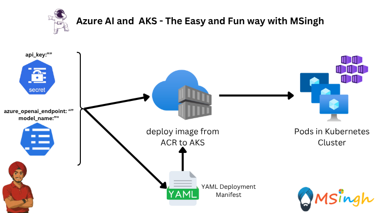

### Create & consume Secrets
Just like ConfigMaps, you can use Secrets to store sensitive information such as passwords, tokens, and SSH keys. Secrets are similar to ConfigMaps, but they are base64 encoded and are intended to be used for sensitive information.

Secrets are created and used in the same way as ConfigMaps. So instead of creating a Secrets resource, let's use the Azure App Config Provider for Kubernetes to store the secrets in Azure Key Vault and use them in the application.

> [!TIP]
> **Set Required Environment Variables**  
> Before proceeding, ensure you have the following environment variables set in your terminal. If you haven't already, or if you've started a new terminal session, run:
>
> ```bash
> export AZURE_API_KEY=<your-azure-openai-api-key>
> export AZURE_OPENAI_ENDPOINT=<your-azure-openai-endpoint>
> export AZURE_MODEL_NAME=<your-azure-openai-model-name>
> export ACR_NAME=<your-azure-container-registry-name>
> ```

We will create a secret to store the Azure OpenAI API Key.
```bash
kubectl create secret generic aoaipythonapp-secrets \
    --from-literal=AZURE_API_KEY=$AZURE_API_KEY
```

The Kubernetes Secret resource is created and the secret is stored in the cluster. You can view the contents of the Secret resource by running the following command.
```bash
kubectl get secret aoaipythonapp-secrets -o yaml
```    

Notice how the output of this is a bit different than the output of the ConfigMap we saw earlier. The value of the secret is base64 encoded and is not human-readable. This isn't particularly secure because base64 encoding can be easily decoded.

Run the following command to view the actual value of the secret.
```bash
kubectl get secret aoaipythonapp-secrets -o jsonpath='{.data.AZURE_API_KEY}' | base64 --decode
```

> [!NOTE]
> **Security Warning:**  
> Anyone with access to the Kubernetes cluster can view the contents of Secret resources. For enhanced security, sensitive information should be stored in a more secure location, such as Azure Key Vault.

### Use Secrets and configMaps in the application

If you remember correctly, we created a ConfigMap to store the OpenAI API endpoint. Now we will use both the ConfigMap and the Secret in our application.

But now the problem is that the ConfigMap we created contains the OpenAI API Key which we have already stored in the Secret. So we will remove the OpenAI API Key from the ConfigMap and use the Secret instead.

First, delete the earlier created ConfigMap.
```bash
kubectl delete configmap aoaipythonapp-configs
```

Then recreate the ConfigMap without the OpenAI API Key.
```bash
kubectl create configmap aoaipythonapp-configs \
--from-literal=AZURE_API_URL=$AZURE_OPENAI_ENDPOINT \
--from-literal=AZURE_MODEL_NAME=$AZURE_MODEL_NAME
```

Check the details of the newly created ConfigMap.
```bash
kubectl get configmap aoaipythonapp-configs -o yaml
```

Now the ConfigMap only contains the OpenAI API endpoint and the model name. The OpenAI API Key is stored in the Secret.

Next, we will update the deployment to use both the ConfigMap and the Secret. Open the deployment file `aoaipythonapp-deployment.yaml` and update it as follows:
```yaml
apiVersion: apps/v1
kind: Deployment
metadata:
  creationTimestamp: null
  labels:
    app: aoaipythonapp
  name: aoaipythonapp
spec:
  replicas: 1
  selector:
    matchLabels:
      app: aoaipythonapp
  strategy: {}
  template:
    metadata:
      creationTimestamp: null
      labels:
        app: aoaipythonapp
    spec:
      containers:
      - image: $ACR_NAME.azurecr.io/aoaipythonapp:latest
        name: aoaipythonapp
        ports:
        - containerPort: 5000
        resources: {}
        envFrom:
        - configMapRef:
            name: aoaipythonapp-configs
        - secretRef:
            name: aoaipythonapp-secrets
status: {}
```

To apply the deployment, run the following command:
```bash
kubectl apply -f manifests/aoaipythonapp-deployment.yaml
```     

Check the Deployment Status:
```bash 
kubectl get deployments
```

Check the Pods:
```bash
kubectl get pods
```

You should see the pod running with the new deployment. The application is now using both the ConfigMap and the Secret to store the OpenAI API endpoint, model name, and API key.

### Access the Application
We will port forward the application to access it from our local machine. Run the following command:
```bash
kubectl port-forward deployment/aoaipythonapp 8000:5000
```

Now that we have port forwarded the python application, lets again hit the application with a sample CURL request to test it.
```bash
curl -X POST http://localhost:8000/chat \
  -H "Content-Type: application/json" \
  -d '{"message": "Hello, can you help me with Azure OpenAI?"}'
```
