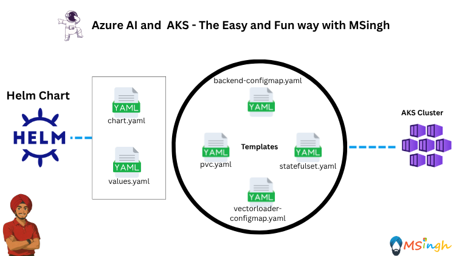
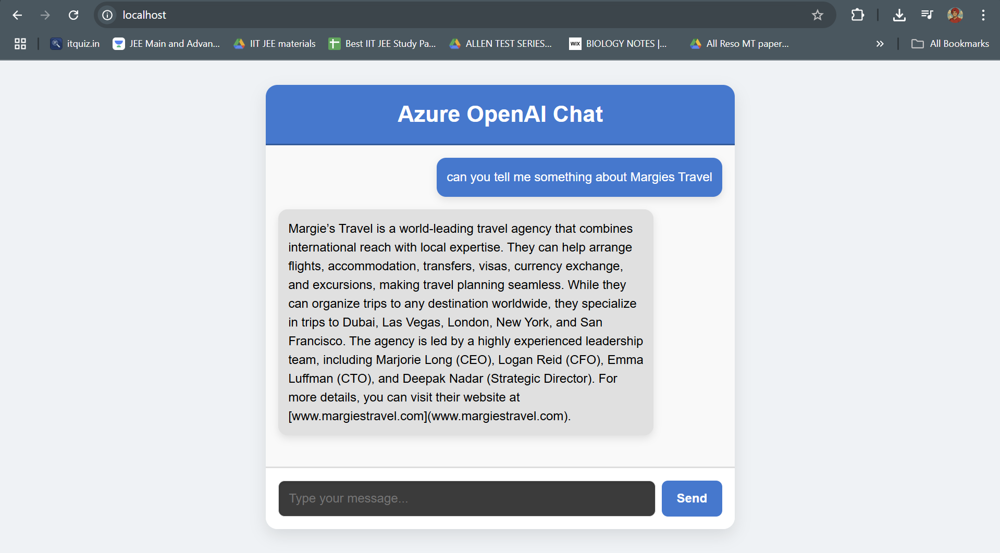

## Deploying Azure OpenAI RAG-app with Helm Charts in AKS



### Prerquisites 
Make sure you have completed or are done with [lab5/RAG_Patterns/RAG_With_PVC.md](../RAG_Patterns/RAG_with_PVC.md)

### Lab Overview
In this lab we will aim to create a `chart/template` the RAG application that we deployed in one of the earlier labs using `Helm` and then deploy the application to our AKS cluster.

### Installing Helm
1. Install Helm on your local machine by following the [Helm installation guide](https://helm.sh/docs/intro/install/).

2. I am using Windows so installing Helm on Windows using `winget`:
```bash
winget install Helm.Helm
```

### Creating a Helm Chart for RAG Application
Make sure you are in the `lab5_Multi_Container_Patterns/RAG_Patterns` directory.
Run the following command to create a new Helm chart named `rag-app`:
```bash
helm create rag-app
```
This command will create a new directory called `rag-app` with the following structure:
```
rag-app/
  Chart.yaml
  values.yaml
  templates/
```
Explanation:
- `Chart.yaml`: Contains metadata about the chart, such as its name, version, and description.
- `values.yaml`: Contains default configuration values for the chart.
- `templates/`: Contains Kubernetes manifest templates that will be rendered into actual Kubernetes resources.

### Modifying the Helm Chart
1. Open the `Chart.yaml` file and update it with the following content:
```yaml
apiVersion: v2
name: rag-app
description: Helm chart for RAG App with Qdrant, Backend, Frontend, and Vector Loader
type: application
version: 0.1.0
appVersion: "1.0"
```
2. Open the `values.yaml` file and update it with the following content:
```yaml
replicaCount: 2

qdrant:
  pvcname: qdrant-pvc
  image: qdrant/qdrant:latest
  storageSize: 1Gi
  storageClass: azurefile-csi

images:
  vectorLoaderImage: acrname.azurecr.io/vector-loader
  chatBackendImage: acrname.azurecr.io/chat-backend
  chatFrontendImage: acrname.azurecr.io/chat-frontend


configMaps:
  chatBackend: chatbackend-configs
  vectorLoader: vectorloader-config

chatBackendConfigs:
  AZURE_API_URL: "https://your-endpoint.openai.azure.com"
  AZURE_API_KEY: "your-api-key"
  AZURE_MODEL_NAME: "gpt-4"
  EMBEDDING_MODEL_NAME: "text-embedding-ada-002"

vectorLoaderConfig:
  QDRANT_CLIENT_URL: "http://localhost:6333"

statefulSet:
  name: "rag-app"
  serviceName: "rag-app-headless"
```

Delete all the dummy Yaml manifest files from the `templates/` directory.

3. Create a new file named `statefulset.yaml` in the `templates/` directory and add the following content (this file would serve as the manifest for maintaining the entire application):
```yaml
apiVersion: apps/v1
kind: StatefulSet
metadata:
  name: {{ .Values.statefulSet.name }}
spec:
  serviceName: {{ .Values.statefulSet.serviceName }}
  replicas: {{ .Values.replicaCount }}
  selector:
    matchLabels:
      app: {{ .Values.statefulSet.name }}
  template:
    metadata:
      labels:
        app: {{ .Values.statefulSet.name }}
    spec:
      containers:
        - name: qdrant
          image: {{ .Values.qdrant.image }}
          ports:
            - containerPort: 6333
          env:
            - name: HOSTNAME
              valueFrom:
                fieldRef:
                  fieldPath: metadata.name
          volumeMounts:
            - name: qdrant-storage
              mountPath: /qdrant/storage
              subPathExpr: $(HOSTNAME)

        - name: vector-loader
          image: {{ .Values.images.vectorLoaderImage }}
          ports:
            - containerPort: 5173
          envFrom:
            - configMapRef:
                name: {{ .Values.configMaps.vectorLoader }}

        - name: chat-backend
          image: {{ .Values.images.chatBackendImage }}
          ports:
            - containerPort: 5000
          envFrom:
            - configMapRef:
                name: {{ .Values.configMaps.chatBackend }}

        - name: chat-frontend
          image: {{ .Values.images.chatFrontendImage }}
          ports:
            - containerPort: 80

      volumes:
        - name: qdrant-storage
          persistentVolumeClaim:
            claimName: {{ .Values.qdrant.pvcname }}
```

4. Create a new file named `pvc.yaml` in the `templates/` directory and add the following content:
```yaml
apiVersion: v1
kind: PersistentVolumeClaim
metadata:
  name: {{ .Values.qdrant.pvcname }}
spec:
  accessModes:
    - ReadWriteMany
  resources:
    requests:
      storage: {{ .Values.qdrant.storageSize }}
  storageClassName: {{ .Values.qdrant.storageClass }}
```

5. Create a new file named `backend-configmap.yaml` in the `templates/` directory and add the following content:
```yaml
apiVersion: v1
kind: ConfigMap
metadata:
  name: {{ .Values.configMaps.chatBackend }}
data:
  AZURE_API_URL: {{ .Values.chatBackendConfigs.AZURE_API_URL | quote }}
  AZURE_API_KEY: {{ .Values.chatBackendConfigs.AZURE_API_KEY | quote }}
  AZURE_MODEL_NAME: {{ .Values.chatBackendConfigs.AZURE_MODEL_NAME | quote }}
  EMBEDDING_MODEL_NAME: {{ .Values.chatBackendConfigs.EMBEDDING_MODEL_NAME | quote }}
```

6. Create a new file named `vectorloader-configmap.yaml` in the `templates/` directory and add the following content:
```yaml
apiVersion: v1
kind: ConfigMap
metadata:
  name: {{ .Values.configMaps.vectorLoader }}
data:
  QDRANT_CLIENT_URL: {{ .Values.vectorLoaderConfig.QDRANT_CLIENT_URL | quote }}
```

The final structure of the `rag-app` chart should look like this:
```
rag-app/
├── Chart.yaml
├── values.yaml
└── templates
    ├── backend-configmap.yaml
    ├── statefulset.yaml
    ├── pvc.yaml
    └── vectorloader-configmap.yaml
```

### Deploying the RAG Application with Helm
If you go through the `values.yaml` file in the Helm Chart, you would notice that we have used some pre-filled values in the Helm Chart, some of which will work and some of which will need to be changed when deploying the application to AKS.

The values that will be changed are:
```simple
1. vectorLoaderImage
2. chatBackendImage
3. chatFrontendImage
4. AZURE_API_URL
5. AZURE_API_KEY
6. AZURE_MODEL_NAME
7. EMBEDDING_MODEL_NAME
8. QDRANT_CLIENT_URL
```

Run the following command to deploy your application to AKS cluster using Helm (make sure you are in the root directory to the `rag-app` chart):
```bash
helm install rag-app ./rag-app \
  --namespace rag-ns \
  --create-namespace \
  --set images.vectorLoaderImage=$ACR_NAME.azurecr.io/vector-loader \
  --set images.chatBackendImage=$ACR_NAME.azurecr.io/chat-backend \
  --set images.chatFrontendImage=$ACR_NAME.azurecr.io/chat-frontend \
  --set chatBackendConfigs.AZURE_API_URL="your-azure-openai-endpoint" \
  --set chatBackendConfigs.AZURE_API_KEY="your-real-api-key" \
  --set chatBackendConfigs.AZURE_MODEL_NAME="your-openai-model-name" \
  --set chatBackendConfigs.EMBEDDING_MODEL_NAME="your-text-embedding-model-name" \
  --set vectorLoaderConfig.QDRANT_CLIENT_URL="http://localhost:6333"
```

The application will be created in a new namespace called `rag-ns`. You can verify the deployment by running:
```bash
kubectl get pods -n rag-ns
```

Now we wish to see the frontend of the application, so we will, for the sake of simplicity, port-forward the frontend service to our local machine:
```bash
kubectl port-forward statefulset/rag-app 80:80 -n rag-ns
```

You can navigate to `http://localhost:80` in your web browser to access the RAG application frontend.

