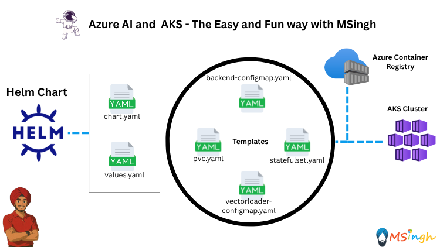

## Helm Charts to ACR



### Prerequisites
Make sure you have completed or are done with [lab5/RAG_Patterns/Helm_Charts.md](./Helm_Charts.md).

### Lab Overview
In this lab, we will push the Helm chart for the RAG application to Azure Container Registry (ACR). This will give you the ability to deploy the RAG application using Helm charts directly from ACR.

### Pushing Helm Charts to ACR
First, set the export variable for your ACR name:
```bash
export ACR_NAME=<your_acr_name>
```
Make sure to replace `<your_acr_name>` with the name of your Azure Container Registry.

Next, login to your ACR using the Azure CLI:
```bash
az acr login --name $ACR_NAME
```

Login to your ACR using Helm:
```bash
helm registry login $ACR_NAME.azurecr.io
```

>**Note:**: When prompted for a username and password, use the ACR admin credentials. You can enable admin user in the Azure portal under your ACR settings.

Now, its time to package your Helm Chart. Make sure you are in the directory where you Helm Chart's `Chart.yaml` file is located. Run the following command to package your Helm chart:
```bash
helm package .
```

Upon packaging, you will see a file named `rag-app-0.1.0.tgz` created in the current directory.
The output will be similar to:
```bash
Successfully packaged chart and saved it to: /my/path/rag-app-0.1.0.tgz
```

Now its time to push the packaged Helm chart to ACR. Run the following command:
```bash
helm push rag-app-0.1.0.tgz oci://$ACR_NAME.azurecr.io/helm
```

You should see an output similar to:
```bash
Pulled: kuljotnewreg.azurecr.io/helm/rag-app:0.1.0
Digest: sha256:2dc1aba68dbc6f6ded1003a49fef2b485cbea008a1083261199da7692cd1b653
```

Now, you can go to the Azure portal and navigate to your ACR. Under the "Repositories" section, you should see a repository named `helm` containing your Helm chart `rag-app`.


---


### Pulling Helm Charts from ACR
You can pull the Helm chart from ACR using the following command:
```bash
helm pull oci://$ACR_NAME.azurecr.io/helm/rag-app --version 0.1.0
```

This command will download the `.tar.gz` file of the Helm chart to your current directory.

You can then unzip the file to view its contents:
```bash
 tar -zvxf rag-app-0.1.0.tgz
```

This will create a directory named `rag-app` containing the Helm chart files.

You can then deploy the Helm chart in the same way as before, using the `helm install` command.

### Summary
In this lab, you learned how to push a Helm chart to Azure Container Registry (ACR) and how to pull it back for deployment. This allows you to manage your Helm charts in a centralized location, making it easier to deploy applications in Kubernetes clusters.