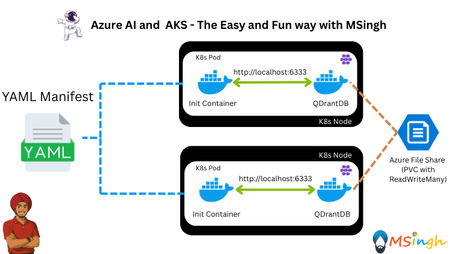

## Preloading Vectors in RAG Patterns Using Init Container

In this lab, you will learn how to preload vectors into a QDrantDB instance using an Init Container in a Kubernetes environment. This is particularly useful for Retrieval-Augmented Generation (RAG) applications where you need to ensure that your vector database is populated with the necessary data before your main application starts.