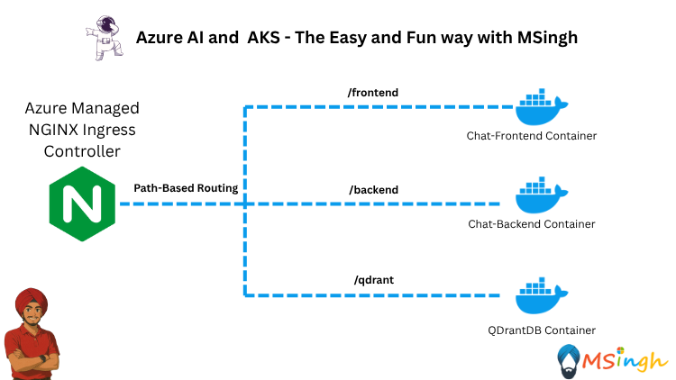
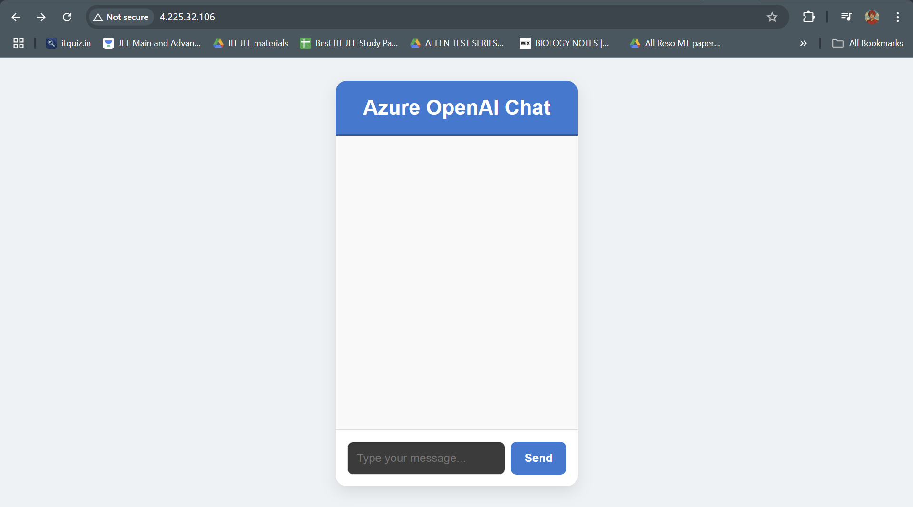
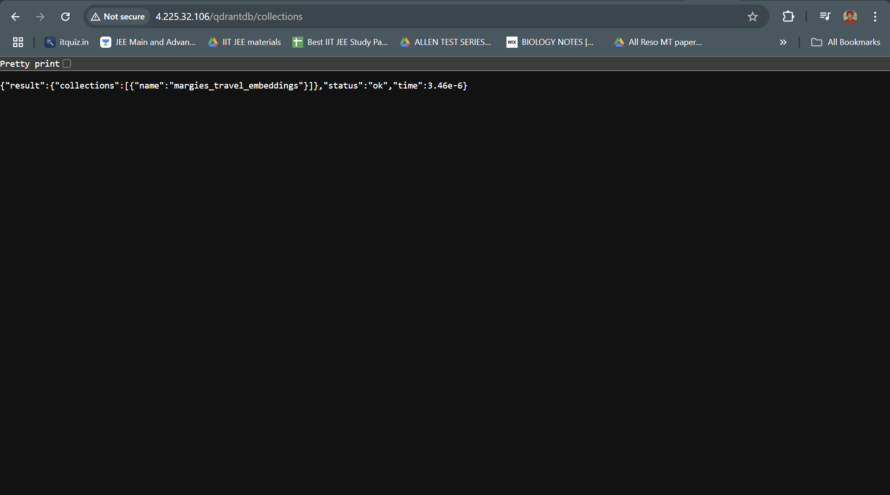
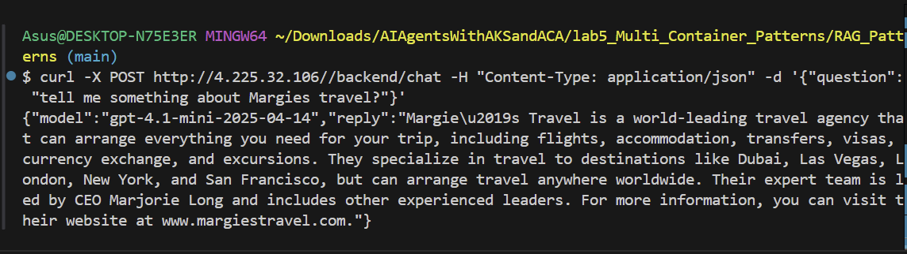

## Setting up Azure Managed NGINX Ingress Controller



### Lab Prerequisites
In this lab, you will set up an Azure Managed NGINX Ingress Controller in your AKS cluster. Before starting, ensure you have the following prerequisites:
- Done the lab -  [RAG with PVC](./RAG_with_PVC.md) to set up the RAG application.
- We will use the same RAG application deployed in the previous lab, so ensure it is running in your AKS cluster.

### Lab Overview
In this lab, you will learn how to set up and configure the Azure Managed NGINX Ingress Controller for your AKS cluster. You will also explore how to manage traffic routing to your RAG application using the Ingress Controller.

Through this lab, we will be exposing both the frontend, backend and QDrantDB services of the RAG application using the Ingress Controller. This is not a production-ready setup, but it will give you a good understanding of how to use the NGINX Ingress Controller in Azure. In a production environment, you would typically only setup the frontend service to be exposed via the Ingress Controller, while the backend and QDrantDB services would be accessed internally within the cluster.

### Setting Export Variables
Before starting, set the following environment variables to make it easier to reference your AKS cluster and resource group:
```bash
export RESOURCE_GROUP=<your-resource-group-name>
export CLUSTER_NAME=<your-aks-cluster-name>
```

### Setting up the clusterIP service for the frontend application
To expose the frontend service of your RAG application, you need to create a `ClusterIP` service. This service will allow the NGINX Ingress Controller to route traffic to the frontend application.

Make sure you are in the `lab5_Multi_Container_Patterns/RAG_Patterns` directory and then if not already then create a `manifests` directory:
```bash
mkdir manifests
```

Next, create a file named `rag-frontend-service.yaml` in the `manifests` directory with the following content:
```yaml
apiVersion: v1
kind: Service
metadata:
  name: ragfrontend-service
spec:
  selector:
    app: rag-app
  type: ClusterIP
  ports:
    - protocol: TCP
      port: 80
      targetPort: 80
```

Apply the service manifest to your AKS cluster:
```bash
kubectl apply -f manifests/rag-frontend-service.yaml
```

### Creating a ClusterIP service for the backend application
To expose the backend service of your RAG application, you need to create another `ClusterIP` service. This service will allow the NGINX Ingress Controller to route traffic to the backend application.

Create a file named `rag-backend-service.yaml` in the `manifests` directory with the following content:
```yaml
apiVersion: v1
kind: Service
metadata:
  name: ragbackend-service
spec:
  selector:
    app: rag-app
  type: ClusterIP
  ports:
    - protocol: TCP
      port: 5000
      targetPort: 5000
```

Apply the service manifest to your AKS cluster:
```bash
kubectl apply -f manifests/rag-backend-service.yaml
```

### Creating a ClusterIP service for the QDrantDB application
To expose the QDrantDB service of your RAG application, you need to create another `ClusterIP` service. This service will allow the NGINX Ingress Controller to route traffic to the QDrantDB application.

Create a file named `rag-qdrantdb-service.yaml` in the `manifests` directory with the following content:
```yaml
apiVersion: v1
kind: Service
metadata:
  name: ragqdrantdb-service
spec:
  selector:
    app: rag-app
  type: ClusterIP
  ports:
    - protocol: TCP
      port: 6333
      targetPort: 6333
```

Apply the service manifest to your AKS cluster:
```bash
kubectl apply -f manifests/rag-qdrantdb-service.yaml
```

### Setting up the NGINX Ingress Controller

First we will need to enable `app-routing` functionality on our existing AKS cluster.
```bash
az aks approuting enable --resource-group $RESOURCE_GROUP --name $CLUSTER_NAME
```

Next we will create the NGINX Ingress controller. Create a file named `rag-nginx-ingress.yaml` in the `manifests` directory with the following content:
```yaml
apiVersion: networking.k8s.io/v1
kind: Ingress
metadata:
  name: rag-app-router
  namespace: default
  annotations:
    nginx.ingress.kubernetes.io/rewrite-target: /$2
spec:
  ingressClassName: webapprouting.kubernetes.azure.com
  rules:
  - http:
      paths:
      - path: /
        pathType: Prefix
        backend:
          service:
            name: ragfrontend-service
            port:
              number: 80
      - path: /backend(/|$)(.*)
        pathType: Prefix
        backend:
          service:
            name: ragbackend-service
            port:
              number: 5000
      - path: /qdrantdb(/|$)(.*)
        pathType: Prefix
        backend:
          service:
            name: ragqdrantdb-service
            port:
              number: 6333
```

>**Tip**: The `rewrite-target` annotation is used to rewrite the URL path before forwarding the request to the backend service. This is useful for removing the `/backend` and `/qdrantdb` prefixes from the URL when routing to the respective services. For example, a request to `http://<ingress-ip>/backend/chat` will be rewritten to `http://<backend-service-ip>:5000/chat` before being forwarded to the backend service.

Apply the Ingress manifest to your AKS cluster:
```bash
kubectl apply -f manifests/rag-nginx-ingress.yaml
```

Verify that the Ingress resource has been created successfully:
```bash
kubectl get ingress -n default
```

You can also see the details of the Ingress resource:
```bash
kubectl describe ingress rag-app-router -n default
```

>**Note**: The NGINX Ingress Controller may take a few minutes to be fully deployed and configured. So please be patient while it is being set up.

You can access your RAG application using the following URLs:
- Frontend: `http://<ingress-ip>/`
- Backend: `http://<ingress-ip>/backend`
- QDrantDB: `http://<ingress-ip>/qdrantdb`

Go to the external IP address of your Ingress Controller in a web browser to access the RAG application frontend.


To see the collection of the QDrantDB, you can use the following URL:
```bash
http://<ingress-ip>/qdrantdb/collections
```



To access the backend service, enter the following CURL POST request in your terminal:
```bash
curl -X POST http://<ingress-ip>/backend/chat -H "Content-Type: application/json" -d '{"question": "tell me something about Margies travel"}'
```

