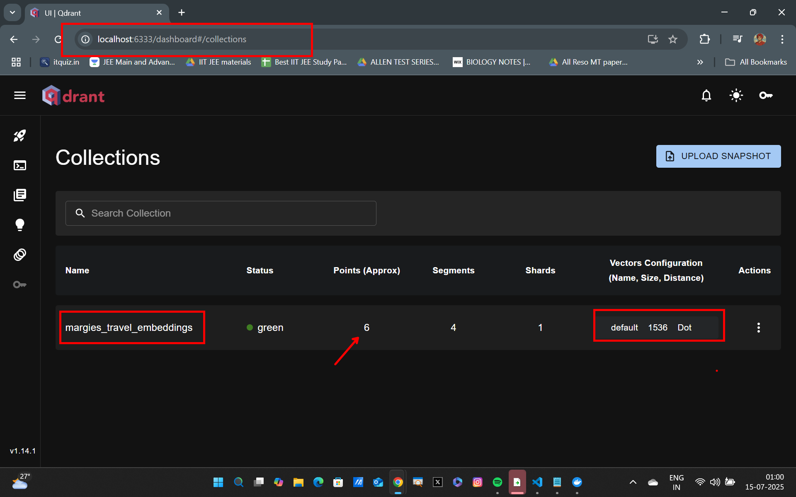
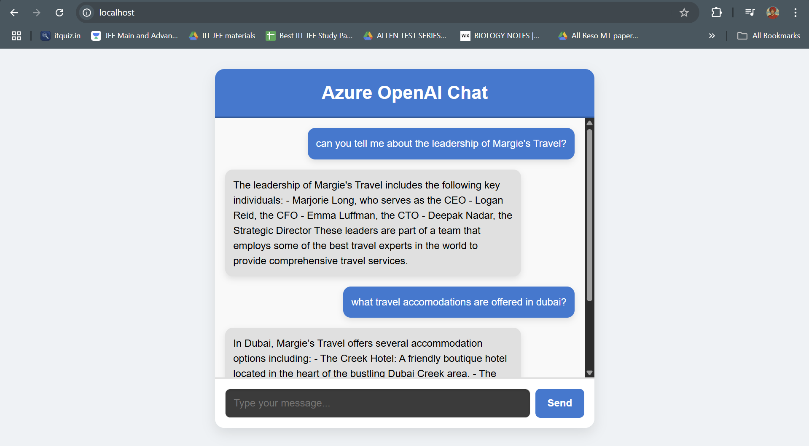
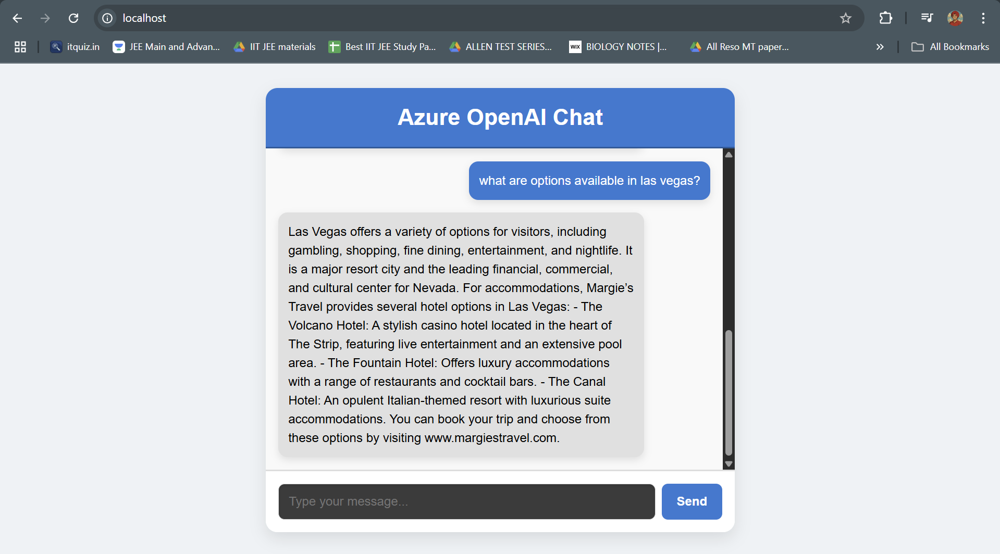

## RAG Application with Azure OpenAI, QDrantDB and Azure File Share CSI


### Overview
In this lab, you will set up a Retrieval-Augmented Generation (RAG) application using Azure OpenAI, QDrantDB, and Azure File Share with Persistent Volume Claims (PVC). The RAG pattern allows you to enhance the capabilities of your AI applications by combining the power of large language models with external data sources.

>**What is QDrantDB?**
> QDrantDB is an open-source vector database that allows you to store and query high-dimensional vectors, making it suitable for applications like semantic search and recommendation systems.

>**What is Azure File Share CSI?**
> Azure File Share CSI (Container Storage Interface) allows you to use Azure File Shares as persistent storage for your Kubernetes applications. This is useful for storing large datasets or files that need to be accessed by multiple pods.

### Applications we will use
The applications that we will use in this lab include:

- **ChatBackend**: A backend service that handles chat interactions and integrates with Azure OpenAI.
- **QDrantDB**: A vector database for storing and querying embeddings.
- **ChatFrontend**: A web-based frontend for interacting with the chat backend.
- **VectorLoader**: A service that loads data into QDrantDB and prepares it for querying.

All of these applications are contained in the `/lab5_Multi_Container_Patterns/RAG_Patterns/` directory, and they are designed to work together to provide a complete RAG solution. We will be containerizing these applications using Docker and deploying them on a Kubernetes cluster.

### Setting Export Variables in the Bash Shell
Before you start, you need to set some environment variables in your bash shell. These variables will be used in some of the commands and scripts throughout this lab. Open your terminal and run the following commands:

```bash
export ACR_NAME="YOUR_ACR_NAME" # The name of your Azure Container Registry
export QDRANT_CLIENT_URL="http://localhost:6333" # The port where the QDrantDB instance listens
export AZURE_API_URL="YOUR_AZURE_OPENAI_ENDPOINT" # The Azure OpenAI endpoint
export AZURE_API_KEY="YOUR_AZURE_API_KEY" # The Azure OpenAI API key
export AZURE_MODEL_NAME="YOUR_AZURE_MODEL_NAME" # The Azure OpenAI model name
export EMBEDDING_MODEL_NAME="YOUR_EMBEDDING_MODEL_NAME" # The embedding model name
```

### Preparing the VectorLoader Application
Before we can deploy the RAG application, we need to ensure that the `VectorLoader` application is ready to preload vectors into QDrantDB. This involves containerizing the application and pushing it to an Azure Container Registry (ACR). The `VectorLoader` application is responsible for reading data from a JSON file and uploading it to QDrantDB. This will now be run as a sidecar container alongside the QDrantDB instance to ensure that the vectors are loaded before the main application starts serving requests. But this can also be run as a `Job` in Kubernetes if you prefer to make incremental updates to your vector database on a scheduled or ad-hoc basis.

Make sure you are in the `lab5_Multi_Container_Patterns/RAG_Patterns/VectorLoader` directory, and follow the steps below to containerize the `VectorLoader` application.

Run the following command to build the Docker image:
```bash
docker build -t vector-loader .
```

Now we must push the image to Azure Container Registry.
Login to your Azure Container Registry:
```bash
az acr login --name $ACR_NAME
```

```bash
docker tag vector-loader $ACR_NAME.azurecr.io/vector-loader
docker push $ACR_NAME.azurecr.io/vector-loader
```

### Preparing the ChatBackend Application
The `ChatBackend` application is a backend service that handles chat interactions and integrates with Azure OpenAI. It exposes a `/chat` endpoint for processing chat messages in the RAG pipeline. It will be containerized and deployed in the Kubernetes cluster alongside QDrantDB.

Make sure you are in the `lab5_Multi_Container_Patterns/RAG_Patterns/ChatBackend` directory, and follow the steps below to containerize the `ChatBackend` application.

```bash
docker build -t chat-backend .
```

Now we must push the image to Azure Container Registry.
```bash
docker tag chat-backend $ACR_NAME.azurecr.io/chat-backend
docker push $ACR_NAME.azurecr.io/chat-backend
```

### Preparing the ChatFrontend Application
The `ChatFrontend` application is a web-based frontend for interacting with the chat backend. It provides a user interface for sending messages and receiving responses from the RAG pipeline. This application will also be containerized and deployed in the Kubernetes cluster.

Make sure you are in the `lab5_Multi_Container_Patterns/RAG_Patterns/ChatFrontend/chat-frontend` directory, and follow the steps below to containerize the `ChatFrontend` application.

```bash
docker build -t chat-frontend .
```
Now we must push the image to Azure Container Registry.
```bash
docker tag chat-frontend $ACR_NAME.azurecr.io/chat-frontend
docker push $ACR_NAME.azurecr.io/chat-frontend
```

### Creating a ConfigMap for the VectorLoader Application
We will have to set up a ConfigMap to store the configuration for the `VectorLoader` application. This will include the QDrantDB URL which is going to be `http://localhost:6333` when running in the Kubernetes cluster. We will reference the export variable `QDRANT_CLIENT_URL` that we set earlier in the bash shell while creating the configMap.

Run the following command to create a ConfigMap for the `VectorLoader` application:
```bash
kubectl create configmap vectorloader-config --from-literal=QDRANT_CLIENT_URL=$QDRANT_CLIENT_URL
```

To view the contents of the ConfigMap resource, you can run the following command:
```bash
kubectl get configmap vectorloader-config -o yaml
```

### Creating a ConfigMap for the ChatBackend Application
We will now create a ConfigMap for the `ChatBackend` application to store the Azure OpenAI API configuration. This will include the following:
- `AZURE_API_URL`: The Azure OpenAI endpoint.
- `AZURE_API_KEY`: The Azure OpenAI API key.
- `AZURE_MODEL_NAME`: The Azure OpenAI model name.
- `EMBEDDING_MODEL_NAME`: The embedding model name.

Run the following command to create a ConfigMap for the `ChatBackend` application:
```bash
kubectl create configmap chatbackend-configs \
--from-literal=AZURE_API_URL=$AZURE_API_URL \
--from-literal=AZURE_API_KEY=$AZURE_API_KEY \
--from-literal=AZURE_MODEL_NAME=$AZURE_MODEL_NAME \
--from-literal=EMBEDDING_MODEL_NAME=$EMBEDDING_MODEL_NAME
```

To view the contents of the ConfigMap resource, you can run the following command:
```bash
kubectl get configmap chatbackend-configs -o yaml
```

### Writing the Kubernetes Manifests
Now that we have containerized the applications and created the necessary ConfigMaps, we will write the Kubernetes manifests to deploy the `VectorLoader`, `QDrantDB`, and `ChatBackend` applications in a Kubernetes cluster.

We will be creating a `statefulset` for all the applications combined. The reason(s) for this are:
- **StatefulSet**: We will use a StatefulSet to manage the deployment of the `QDrantDB` instance, ensuring that it has a stable network identity and persistent storage. Moreoever, we need one single pod that houses these application containers.

- **PVC**: We will use a Persistent Volume Claim (PVC) to provide persistent storage for the `QDrantDB` instance. This will allow the database to retain its data even if the pod is restarted or rescheduled. Here defining and deploying a `StatefulSet` with a PVC is essential for the `QDrantDB` instance to ensure data persistence.

Make sure you are in the `lab5_Multi_Container_Patterns/RAG_Patterns/` directory.

Create a `manifests` directory if it does not already exist:
```bash
mkdir manifests
```

First we will create a Persistent Volume Claim (PVC) for the QDrantDB instance. This will allow us to store the data persistently in Azure File Share.
Create a file named `qdrant-pvc.yaml` in the `manifests` directory with the following content:

```yaml
apiVersion: v1
kind: PersistentVolumeClaim
metadata:
  name: qdrant-pvc
spec:
  accessModes:
    - ReadWriteMany
  resources:
    requests:
      storage: 1Gi
  storageClassName: azurefile-csi
```

Apply the PVC manifest to create the Persistent Volume Claim:
```bash
kubectl apply -f manifests/qdrant-pvc.yaml
```
To view the PV status, you can run the following command:
```bash
kubectl get pv
```

To view the status of the PVC, you can run the following command:
```bash
kubectl get pvc qdrant-pvc
```

>**NOTE**: The PVC will show `Pending` status until it is claimed by a PV. This is expected behavior as the PVC is waiting for a Persistent Volume to be bound to it. The PV also takes some time to be created and bound to the PVC, so please be patient.

Next, we will create a `StatefulSet` definition for the entire RAG application. Create a file named `rag-app.yaml` in the `manifests` directory with the following content:

```yaml 
apiVersion: apps/v1
kind: StatefulSet
metadata:
  name: rag-app
spec:
  serviceName: "rag-app-headless"
  replicas: 2
  selector:
    matchLabels:
      app: rag-app
  template:
    metadata:
      labels:
        app: rag-app
    spec:
      containers:
        - name: qdrant
          image: qdrant/qdrant:latest
          ports:
            - containerPort: 6333
          env:
            - name: HOSTNAME
              valueFrom:
                fieldRef:
                  fieldPath: metadata.name
          volumeMounts:
            - name: qdrant-storage
              mountPath: /qdrant/storage
              subPathExpr: $(HOSTNAME)

        - name: vector-loader
          image: $ACR_NAME.azurecr.io/vector-loader
          ports:
            - containerPort: 5173
          envFrom:
            - configMapRef:
                name: vectorloader-config

        - name: chat-backend
          image: $ACR_NAME.azurecr.io/chat-backend
          ports:
            - containerPort: 5000
          envFrom:
            - configMapRef:
                name: chatbackend-configs

        - name: chat-frontend
          image: $ACR_NAME.azurecr.io/chat-frontend
          ports:
            - containerPort: 80

      volumes:
        - name: qdrant-storage
          persistentVolumeClaim:
            claimName: qdrant-pvc
```

Apply the StatefulSet manifest to create the StatefulSet:
```bash
kubectl apply -f manifests/rag-app.yaml
```

To check the status of the StatefulSet, you can run the following command:
```bash
kubectl get statefulsets
```
To check the status of the pods, you can run the following command:
```bash
kubectl get pods
```
You should see the `rag-app` StatefulSet listed with the number of replicas and their status. The pods should be in a `Running` state.

To check the description and processes of a specific pod, you can run the following command:
```bash
kubectl describe pod <pod-name>
```

Now lets check the logs of the `VectorLoader` container to ensure that it has successfully loaded the vectors into QDrantDB:
```bash
kubectl logs <pod-name> -c vector-loader
```
>**Note**: You should replace `<pod-name>` with the actual name of the pod running the `VectorLoader` container. You should see logs indicating that the vectors have been successfully uploaded to the QDrantDB instance.

### Viewing the QDrantDB Instance
You can access the QDrantDB instance using the following command:
```bash
kubectl port-forward statefulset/rag-app 6333:6333
```

Navigate to `http://localhost:6333/dashboard` in your web browser to access the QDrantDB instance. You can use the QDrantDB web interface to explore the data and perform queries.



To verify if the `qdrant` container is indeed mounted to the Azure File Share, you can run the following command to check the mounted volumes:
```bash
kubectl exec -it <pod-name> -- df -h
```

### Accessing the ChatFrontend Application
To access the `ChatFrontend` application, you can use port forwarding to expose the frontend service on your local machine. Run the following command:

```bash
kubectl port-forward statefulset/rag-app 80:80
```

Try a couple of queries in the chat frontend. You can use the following sample queries:
```plaintext
- what is margies travel?
- can you tell me about the leadership of Margie's Travel?
- what travel accomodations are offered in dubai?
- what are options available in las vegas?
- what travel accomodations are offered in las vegas?
```


---


### Conclusion
In this lab, you have successfully set up a Retrieval-Augmented Generation (RAG) application using Azure OpenAI, QDrantDB, and Azure File Share with Persistent Volume Claims (PVC). You have containerized the `VectorLoader`, `ChatBackend`, and `ChatFrontend` applications, deployed them in a Kubernetes cluster, and verified that the data was loaded into QDrantDB. You also accessed the QDrantDB instance and interacted with the chat frontend application.

🚀 **Congratulations!**  
You’ve just completed a challenging lab that brought together Azure OpenAI, QDrantDB, Kubernetes, and persistent cloud storage. By containerizing, deploying, and integrating these components, you’ve gained hands-on experience with advanced cloud-native patterns and AI workloads. This is a major achievement—well done!
