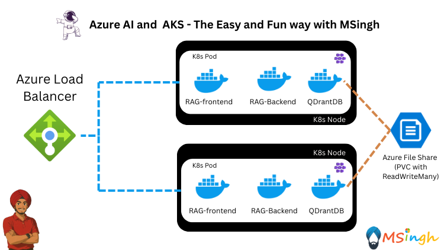

## RAG Application with Azure OpenAI, QDrantDB and Azure File Share CSI

### Overview
In this lab, you will set up a Retrieval-Augmented Generation (RAG) application using Azure OpenAI, QDrantDB, and Azure File Share with Persistent Volume Claims (PVC). The RAG pattern allows you to enhance the capabilities of your AI applications by combining the power of large language models with external data sources.

>**What is QDrantDB?**
> QDrantDB is an open-source vector database that allows you to store and query high-dimensional vectors, making it suitable for applications like semantic search and recommendation systems.

>**What is Azure File Share CSI?**
> Azure File Share CSI (Container Storage Interface) allows you to use Azure File Shares as persistent storage for your Kubernetes applications. This is useful for storing large datasets or files that need to be accessed by multiple pods.

