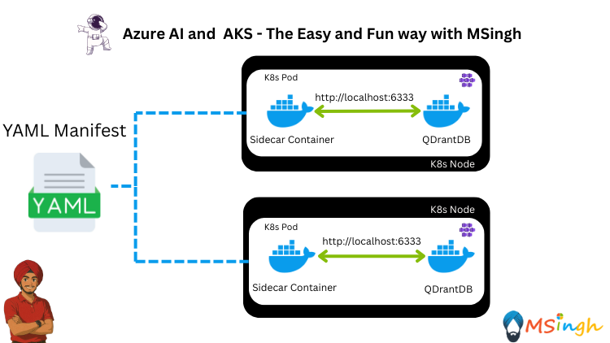

## Preloading Vectors in RAG Patterns Using Sidecar Container



In this lab, you will learn how to preload vectors into a QDrantDB instance using a Sidecar Container in a Kubernetes environment. This is particularly useful for Retrieval-Augmented Generation (RAG) applications where you need to ensure that your vector database is populated with the necessary data before your main application starts.

### Setting Export Variables in the Bash Shell
Before you start, you need to set some environment variables in your bash shell. These variables will be used in some of the commands and scripts throughout this lab. Open your terminal and run the following commands:

```bash
export ACR_NAME=<your_acr_name> # The name of your Azure Container Registry
export QDRANT_CLIENT_URL="http://localhost:6333" # The port where the QDrantDB instance listens
```


### Containerising `VectorLoader` Application 

The `VectorLoader` application is a simple Python script that reads data from a json file (which is a combination of `text` and `vector` entries) and uploads it to a QDrantDB instance within a `collection` named `margies_travel_embeddings`. The script uses the `qdrant-client` library to interact with the database.

First make sure you are in the `lab5_Multi_Container_Patterns/RAG_Patterns/VectorLoader` directory; Then run the following command to build the Docker image:

```bash
docker build -t vector-loader .
```

Now we shall push the image to our Azure Container Registry.

login to your Azure Container Registry:
```bash
az acr login --name $ACR_NAME
```

Next, tag the image with your ACR name:
```bash
docker tag vector-loader $ACR_NAME.azurecr.io/vector-loader
```

Finally, push the image to your Azure Container Registry:
```bash
docker push $ACR_NAME.azurecr.io/vector-loader
```

### Containerising `QDrantDB` Application
The `QDrantDB` application is a Docker image that runs the QDrant vector database. We will be using the official QDrantDB image from Docker Hub which is already optimised for running in a containerized environment and is tagged as `qdrant/qdrant`. 

To give you a better understanding of how to run QDrantDB in a container, you can use the following command to pull the image:
```bash
docker pull qdrant/qdrant
```

Then run the QDrantDB container with the following command:
```bash
docker run -p 6333:6333 qdrant/qdrant
```

Then go to your browser and navigate to `http://localhost:6333` to check if the QDrantDB instance is running. You should see a welcome message from QDrantDB. 

To open the Admin Dashboard UI, you can navigate to `http://localhost:6333/dashboard` in your browser. This will allow you to manage your collections and view the data stored in QDrantDB.

### Deploying the Entire Setup in Kubernetes

We will now deploy both the `VectorLoader` and `QDrantDB` applications in a Kubernetes cluster using a Sidecar Container Design Pattern. The Sidecar Container will run the `VectorLoader` application to preload vectors into the QDrantDB instance before the main application starts. This is a production-ready setup that ensures your vector database is populated with the necessary data before serving requests.

We will first create a `configMap` to store the QDrantDB connection details, specifically the URL where the QDrantDB instance is running. This will be used by the Sidecar Container to connect to the QDrantDB instance.

```bash
kubectl create configmap qdrant-config --from-literal=QDRANT_CLIENT_URL=$QDRANT_CLIENT_URL
```
Check and view the created configMap:
```bash
kubectl get configmaps
```
```bash
kubectl describe configmap qdrant-config
```

Make sure you are in the `lab5_Multi_Container_Patterns/RAG_Patterns` directory; Then run the following command to create a `manifests` directory:
```bash
mkdir manifests
```
Next, create a file named `qdrantdb.yaml` in the `manifests` directory with the following content:

```yaml
apiVersion: apps/v1
kind: Deployment
metadata:
  name: qdrant-with-sidecar
spec:
  replicas: 2
  selector:
    matchLabels:
      app: qdrant
  template:
    metadata:
      labels:
        app: qdrant
    spec:
      containers:
        - name: qdrant
          image: qdrant/qdrant:latest
          ports:
            - containerPort: 6333
          env:
            - name: QDRANT__SERVICE__HOST
              value: "0.0.0.0"
          

        - name: embed-sidecar
          image: $ACR_NAME.azurecr.io/vector-loader:latest
          envFrom:
            - configMapRef:
                name: qdrant-config
          command: ["/bin/sh", "-c"]
          args:
            - |
              echo "Waiting for Qdrant...";
              until curl -s http://localhost:6333; do
                sleep 2;
              done;
              echo "Running embedding upsert script...";
              python /app/app.py

```

>**Note:** Make sure to replace `$ACR_NAME` with your actual Azure Container Registry name in the `qdrantdb.yaml` file.

>**YAML Explanation:**
- The `embed-sidecar` container that runs the `VectorLoader` application.
- The `command` and `args` fields ensure that the Sidecar Container waits for the QDrantDB instance to be ready before running the embedding upsert script. What this does is it checks if the QDrantDB instance is running by sending a request to `http://localhost:6333` and waits until it gets a response. Once the QDrantDB instance is ready, it runs the `app.py` script to preload vectors into the database.
- The `containers` section defines the main `qdrant` container that runs the QDrantDB instance.

Next, run the following command to deploy the `qdrant-with-sidecar` deployment in your Kubernetes cluster:

```bash
kubectl apply -f manifests/qdrantdb.yaml
```

You can check the status of the deployment by running:
```bash
kubectl get deployments
```

You should see the `qdrant-with-sidecar` deployment listed with the number of replicas and their status. Run the command to get the pods:
```bash
kubectl get pods
```

Since the replica count is set to 2, you should see two pods running. The Sidecar Container will run alongside the main QDrantDB container.

Until now, the Sidecar Container should have preloaded the vectors into the QDrantDB instance. You can verify this by checking the logs of the `embed-sidecar` container:

```bash
kubectl logs <pod-name> -c embed-sidecar
```
>**Note**: You should replace `<pod-name>` with the actual name of the pod running the `embed-sidecar` container. You should see logs indicating that the vectors have been successfully uploaded to the QDrantDB instance.

### Seeing the Data in QDrantDB

We will now attempt to see the data loaded into the QDrantDB instance. The first step will be to port-forward the QDrantDB service to your local machine so that you can access it via the browser.
```bash
kubectl port-forward deployment/qdrant-with-sidecar 6333:6333
```
Now, open your browser and navigate to `http://localhost:6333/dashboard`. You should see the QDrantDB Admin Dashboard UI.
In the dashboard, you can see the `margies_travel_embeddings` collection that was created by the `VectorLoader` application. You can click on the collection to view the data stored in it. You should see the text and vector entries that were preloaded by the Sidecar Container.

### Conclusion
In this lab, you learned how to preload vectors into a QDrantDB instance using a Sidecar Container in a Kubernetes environment. You containerised the `VectorLoader` application, deployed it alongside the QDrantDB instance, and ensured that the vectors were preloaded before the main application would start. This setup is essential for Retrieval-Augmented Generation (RAG) applications where having a populated vector database is crucial for performance and accuracy.