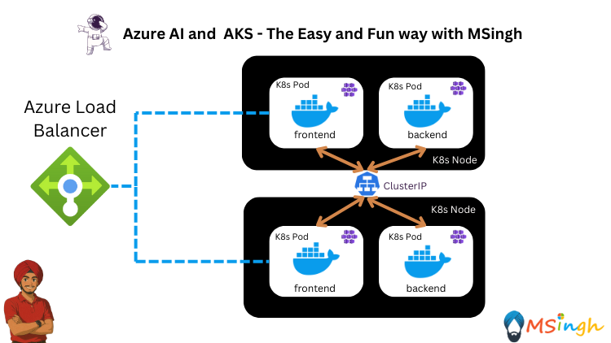

## Azure OpenAI Chat with ClusterIP Service



### Lab Overview

In this lab, you'll set up a simple chat application using Azure OpenAI and a ClusterIP service. The ClusterIP service enables seamless communication between the frontend and backend components within your Kubernetes cluster. This approach works even if the frontend and backend are deployed in separate pods, as the ClusterIP service efficiently routes requests between them.

> **Note:**  
> You'll use the same applications as in the `simple-fb-sidecar.md` lab, but this time, a ClusterIP service will connect the frontend and backend components. If you haven't completed the `simple-fb-sidecar.md` lab, please do so first. The steps for running the backend and frontend services locally are also the same as in that lab, so you can refer to it for guidance.

### Pushing the Backend Image to ACR
Now that we have our backend service running locally, we can push the backend image to Azure Container Registry (ACR). 

Export your ACR name and login to your ACR:
```bash
export ACR_NAME="your-acr-name"
az acr login --name $ACR_NAME
```

Next, tag the backend image with your ACR name:
```bash
docker tag chatbackend:latest $ACR_NAME.azurecr.io/chatbackend:latest
```

Finally, push the backend image to your ACR:
```bash
docker push $ACR_NAME.azurecr.io/chatbackend:latest
```

### Deploying the Backend Service to AKS as a Deployment
Now that the backend image is in ACR, we can deploy it to Azure Kubernetes Service (AKS). First, create a `manifests` directory in the `lab5_Multi_Container_Patterns/Simple_Frontend_Backend_Chat_App` directory:
```bash
mkdir manifests
```

Next, create a file named `chatbackend-deployment.yaml` in the `manifests` directory with the following content:

```yaml
apiVersion: apps/v1
kind: Deployment
metadata:
  name: chatbackend
spec:
  replicas: 2
  selector:
    matchLabels:
      app: chatbackend
  template:
    metadata:
      labels:
        app: chatbackend
    spec:
     affinity: 
       podAntiAffinity:
        requiredDuringSchedulingIgnoredDuringExecution:
        - labelSelector:
            matchExpressions:
             - key: app
               operator: In
               values:
               - chatbackend
          topologyKey: kubernetes.io/hostname
      containers:
        - name: chatbackend
          image: $ACR_NAME.azurecr.io/chatbackend:latest
          ports:
            - containerPort: 5000
          envFrom:
            - configMapRef:
                name: chatbackend-configs
```

Now, apply the deployment manifest to your AKS cluster:
```bash
kubectl apply -f manifests/chatbackend-deployment.yaml
```

Verify that the deployment is running:
```bash
kubectl get deployments
```

Verify that the pods are running in different nodes:
```bash
kubectl get pods
``` 

### Exposing the Backend Service with a ClusterIP Service
To expose the backend service, create a service manifest file named `chatbackend-service.yaml` in the `manifests` directory with the following content:

```yaml
apiVersion: v1
kind: Service
metadata:
  name: chatbackend-service
spec:
  selector:
    app: chatbackend
  type: ClusterIP
  ports:
    - protocol: TCP
      port: 5000
      targetPort: 5000
```

Now, apply the service manifest to your AKS cluster:
```bash
kubectl apply -f manifests/chatbackend-service.yaml
```

Verify that the service is created:
```bash
kubectl get services
```
You should see the `chatbackend-service` listed with a ClusterIP. Note that this service is only accessible within the cluster, that is, the clusterIP you see is a privateIP address that can be used by other pods in the cluster to communicate with the backend service.

### Deploying the Frontend Service to AKS as a Deployment

Now before we deploy the frontend service, we need to ensure that it can communicate with the backend service using the ClusterIP.

Go to the `ChatFrontend/chat-frontend/src/App.jsx` file and change the `/chat` call route from `${import.meta.env.VITE_BACKEND_URL}/chat` to `/api/chat`

Now create a file named `nginx.conf` (or modify the existing one if you have it) in the `ChatFrontend/chat-frontend` directory with the following content:

```nginx
server {
  listen 80;

  location / {
    root /usr/share/nginx/html;
    index index.html;
    try_files $uri $uri/ /index.html;
  }

  location /api/ {
    proxy_pass http://chatbackend-service:5000/;
    proxy_http_version 1.1;
    proxy_set_header Host $host;
    proxy_set_header X-Real-IP $remote_addr;
  }
}
```

Modify the frontend Dockerfile to copy the custom nginx.conf into the nginx container
```dockerfile
# Use the official Node.js image for building the app
FROM node:18-alpine AS build

# Set the working directory
WORKDIR /app

# Copy package files and install dependencies
COPY package.json package-lock.json ./
RUN npm ci

# Copy the rest of the application files
COPY . .

# Build the application
RUN npm run build

# Use the official Nginx image for serving the app
FROM nginx:alpine AS production

# Copy the built files to the Nginx web server directory
COPY --from=build /app/dist /usr/share/nginx/html

# Copy the custom NGINX configuration
COPY nginx.conf /etc/nginx/conf.d/default.conf

# Expose port 80
EXPOSE 80

# Start NGINX
CMD ["nginx", "-g", "daemon off;"]
```

Now we will create the frontend image again:
```bash
docker build -t chatfrontend:latest .
```

Now that we have the frontend service containerized and confirmed to be running locally, we can push it to a container registry. In this case, we will use Azure Container Registry (ACR).

Run the following command to tag the container image with the ACR registry name.
```bash
docker tag chatfrontend:latest $ACR_NAME.azurecr.io/chatfrontend:latest
```

Now that the image is tagged, we can push it to ACR.
```bash
docker push $ACR_NAME.azurecr.io/chatfrontend:latest
```

Now create a file named `chatfrontend-deployment.yaml` in the `manifests` directory with the following content:

```yaml
apiVersion: apps/v1
kind: Deployment
metadata:
  name: chatfrontend
spec:
  replicas: 2
  selector:
    matchLabels:
      app: chatfrontend
  template:
    metadata:
      labels:
        app: chatfrontend
    spec:
      affinity: 
       podAntiAffinity:
        requiredDuringSchedulingIgnoredDuringExecution:
        - labelSelector:
            matchExpressions:
             - key: app
               operator: In
               values:
               - chatfrontend
          topologyKey: kubernetes.io/hostname
      containers:
        - name: chatfrontend
          image: $ACR_NAME.azurecr.io/chatfrontend:latest
          ports:
            - containerPort: 80
```

Now, apply the deployment manifest to your AKS cluster:
```bash
kubectl apply -f manifests/chatfrontend-deployment.yaml
```
Verify that the deployment is running:
```bash
kubectl get deployments
```
Verify that the pods are running:
```bash
kubectl get pods
```

### Exposing the Frontend with a LoadBalancer Service
To expose the frontend service, create a service manifest file named `chatfrontend-service.yaml` in the `manifests` directory with the following content:

```yaml
apiVersion: v1
kind: Service
metadata:
  name: chatfrontend-service
spec:
  type: LoadBalancer
  selector:
    app: chatfrontend
  ports:
    - protocol: TCP
      port: 80
      targetPort: 80
```

Now, apply the service manifest to your AKS cluster:
```bash
kubectl apply -f manifests/chatfrontend-service.yaml
```

Confirm your service is created and the load balancer is configured using the following command.
```bash
kubectl get service chatfrontend-service
```

**Note:** The `EXTERNAL-IP` field may take a few minutes to be assigned. Once it is assigned, you can access the frontend service using that IP address.

For more detailed information about your service, use the following command.
```bash
kubectl describe service chatfrontend-service
```

**Note:** Navigating to the EXTERNAL-IP address of the load balancer service in your browser will allow you to access the frontend of the chat application. The frontend will communicate with the backend service using the ClusterIP service we created earlier.

