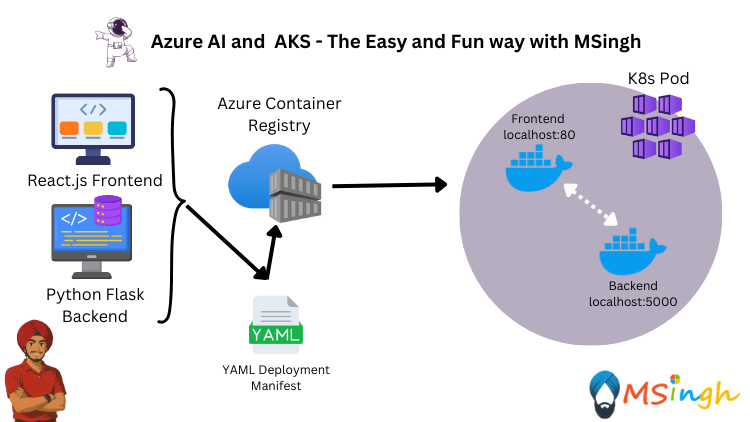

## Simple Frontend Backend Chat App with Sidecar Pattern



This example demonstrates a simple chat application using the Sidecar pattern. The architecture consists of a frontend service that communicates with a backend service. The frontend service being the main container while the backend service being the sidecar container

### Running our Backend Service Locally

First we will set the variables in bash shell to use later when running the application locally first. Make sure to replace the placeholders with your Azure OpenAI endpoint, API key, and model name.

```bash
export AZURE_OPENAI_ENDPOINT="your-azure-openai-endpoint"
```

```bash
export AZURE_API_KEY="your-azure-api-key"
```

```bash
export AZURE_MODEL_NAME="your-azure-model-name"
```

Replace the placeholders with your Azure OpenAI endpoint, API key, and model name. You can find these values in the Azure Portal under the Azure OpenAI or the Azure AI Foundry Resource.

Build the docker image first (make sure you are in the `lab5_Multi_Container_Patterns/Simple_Frontend_Backend_Chat_App` directory):
```bash
docker build -t chatbackend:latest .
```

Then run the backend service using Docker:
```bash
docker run -p 5000:5000 \
-e AZURE_API_URL=$AZURE_OPENAI_ENDPOINT \
-e AZURE_API_KEY=$AZURE_API_KEY \
-e AZURE_MODEL_NAME=$AZURE_MODEL_NAME \
chatbackend:latest
```

### Running our Frontend Service Locally

First make sure you are in the `lab5_Multi_Container_Patterns/Simple_Frontend_Backend_Chat_App` directory. Then build the frontend docker image by passing in the `BACKEND_URL` environment variable too:
```bash
docker build -t chatfrontend:latest --build-arg VITE_BACKEND_URL=http://localhost:5000 .
```

Then run the frontend service using Docker:
```bash
docker run -p 80:80 chatfrontend:latest
```

### Pushing our Backend Image to ACR

First we will create a `configMap` for our Backend Service to insert the environment variables during runtime

```bash
kubectl create configmap chatbackend-configs \
--from-literal=AZURE_API_URL=$AZURE_OPENAI_ENDPOINT \
--from-literal=AZURE_API_KEY=$AZURE_API_KEY \
--from-literal=AZURE_MODEL_NAME=$AZURE_MODEL_NAME
```

To view the contents of the ConfigMap resource, you can run the following command.
```bash
kubectl get configmap chatbackend-configs -o yaml
```

This command retrieves the ConfigMap resource and outputs it in YAML format, allowing you to see the key-value pairs stored in the ConfigMap.

Now that we also have the backend service containerized and confirmed to be running locally, we can push it to a container registry. In this case, we will use Azure Container Registry (ACR).

Run the following commands to get the name of the ACR and login.
```bash
az acr login --name $ACR_NAME
```
Make sure to replace `$ACR_NAME` with the name of your Azure Container Registry.

Run the following command to tag the container image with the ACR registry name.
```bash
docker tag chatbackend:latest $ACR_NAME.azurecr.io/chatbackend:latest
```

Now that the image is tagged, we can push it to ACR.
```bash
docker push $ACR_NAME.azurecr.io/chatbackend:latest
```

### Pushing our Frontend Image to ACR
Now, before we can push the image to ACR, we need to create a custom NGINX configuration file (`nginx.conf`) to proxy requests from `/api` to the backend Flask app running on `localhost:5000` inside the pod.

Create a file named `nginx.conf` in the `lab5_Multi_Container_Patterns/Simple_Frontend_Backend_Chat_App/ChatFrontend/chat-frontend` directory with the following content:

```nginx
server {
  listen 80;

  location / {
    root /usr/share/nginx/html;
    index index.html;
    try_files $uri $uri/ /index.html;
  }

  location /api/ {
    proxy_pass http://localhost:5000/;
    proxy_http_version 1.1;
    proxy_set_header Host $host;
    proxy_set_header X-Real-IP $remote_addr;
  }
}
```

Now go to `/src/App.jsx` and change the `/chat` call route from `${import.meta.env.VITE_BACKEND_URL}/chat` to `/api/chat` 

Modify the frontend Dockerfile to copy the custom nginx.conf into the nginx container
```Dockerfile
# Use the official Node.js image for building the app
FROM node:18-alpine AS build

# Set the working directory
WORKDIR /app

# Copy package files and install dependencies
COPY package.json package-lock.json ./
RUN npm ci

# Copy the rest of the application files
COPY . .

# Build the application
RUN npm run build

# Use the official Nginx image for serving the app
FROM nginx:alpine AS production

# Copy the built files to the Nginx web server directory
COPY --from=build /app/dist /usr/share/nginx/html

# Copy the custom NGINX configuration
COPY nginx.conf /etc/nginx/conf.d/default.conf

# Expose port 80
EXPOSE 80

# Start NGINX
CMD ["nginx", "-g", "daemon off;"]
```

Now we will create the frontend image again
```bash
docker build -t chatfrontend:latest .
```

Now that we have the frontend service containerized and confirmed to be running locally, we can push it to a container registry. In this case, we will use Azure Container Registry (ACR).

Run the following command to tag the container image with the ACR registry name.
```bash
docker tag chatfrontend:latest $ACR_NAME.azurecr.io/chatfrontend:latest
```

Now that the image is tagged, we can push it to ACR.
```bash
docker push $ACR_NAME.azurecr.io/chatfrontend:latest
```

### Deploying the Application to AKS

Create a new directory for the manifests if it doesn't exist:
```bash
mkdir manifests
```

Create a manifest file for both the frontend and backend deployments in the `manifests` directory with a file named as `simple-fb-sidecar-deployment.yaml`:
```bash
apiVersion: apps/v1
kind: Deployment
metadata:
  name: azure-openai-chat
  labels:
    app: azure-openai-chat
spec:
  replicas: 2
  selector:
    matchLabels:
      app: azure-openai-chat
  template:
    metadata:
      labels:
        app: azure-openai-chat
    spec:
      containers:
        - name: chatbackend
          image: $ACR_NAME.azurecr.io/chatbackend:latest
          ports:
            - containerPort: 5000
          envFrom:
            - configMapRef:
                name: chatbackend-configs
        - name: chatfrontend
          image: $ACR_NAME.azurecr.io/chatfrontend:latest
          ports:
            - containerPort: 80
```

Now that we have the Deployment resource manifest file ready, we can deploy it to the AKS cluster.
```bash
kubectl apply -f manifests/simple-fb-sidecar-deployment.yaml
```

To view the status of the Deployment resource, you can run the following command.
```bash
kubectl get deployments azure-openai-chat
```

To check the status of the pods, you can run:
```bash
kubectl get pods
```

To view the application in your browser, you can run a port-forward command to forward the port from the Pod to your local machine.
```bash
kubectl port-forward deployment/azure-openai-chat 8000:80
```

To check the application, open your browser and navigate to `http://localhost:8000`. You should see the chat application interface.

