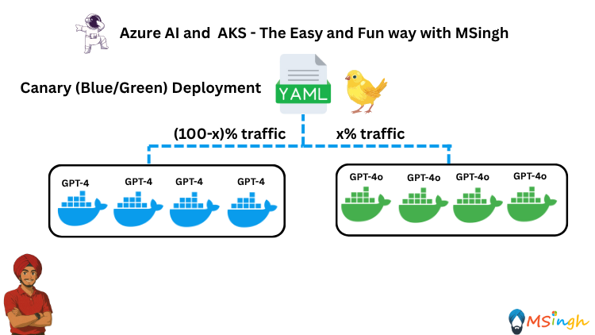

## Canary (Blue/Green) Deployment Strategy with AKS



### Lab Overview
In this lab, you will learn how to implement a Canary Deployment strategy using Azure Kubernetes Service (AKS). This approach allows you to deploy new versions of your application gradually, minimizing risk and ensuring stability. 

The lab will cover the following steps:
1. **Deploying GPT-4 Chat App**
   - Deploy the initial version of the GPT-4 Chat application to AKS.

2. **Creating a Canary Deployment**
    - Set up a canary deployment for the new version of the application.

3. **Deploying GPT-4o Chat App**
   - Deploy the GPT-4o Chat application alongside the existing GPT-4 Chat application in AKS. This will gradually route a portion of the traffic to the new version.
### Setting up Export Variables
Before starting the lab, ensure you have the following environment variables set up in your terminal:

```bash
export ACR_NAME="<your_azure_container_registry_name>"
```

### Building and Pushing the GPT-4 Chat App to ACR
Go to the `Lab6_Deployment_Strategies/gpt4_app/.env` file and set the following environment variables:
```markdown
1. AZURE_API_URL=""
2. AZURE_API_KEY=""
3. AZURE_MODEL_NAME=""
```

Build the Docker image for the GPT-4 Chat application (make sure you are in the `lab6_Deployment_Strategies/gpt4_app` directory):
```bash
docker build -t aoaichatapp .
``` 

Push the Docker image to your container registry:
```bash
az acr login --name $ACR_NAME
docker tag aoaichatapp $ACR_NAME.azurecr.io/aoaichatapp:v1
docker push $ACR_NAME.azurecr.io/aoaichatapp:v1
```

### Building and Pushing the GPT-4o Chat App to ACR
Go to the `Lab6_Deployment_Strategies/gpt4o_app/.env` file and set the following environment variables:
```markdown
1. AZURE_API_URL=""
2. AZURE_API_KEY=""
3. AZURE_MODEL_NAME=""
```

Build the Docker image for the GPT-4o Chat application (make sure you are in the `lab6_Deployment_Strategies/gpt4o_app` directory):
```bash
docker build -t aoaichatapp .
```

Push the Docker image to your container registry:
```bash
az acr login --name $ACR_NAME
docker tag aoaichatapp $ACR_NAME.azurecr.io/aoaichatapp:v2
docker push $ACR_NAME.azurecr.io/aoaichatapp:v2
```

> **Note:** Note that the `v1` and `v2` tags are used to differentiate between the two versions of the application. The `v1` tag corresponds to the GPT-4 Chat application, while the `v2` tag corresponds to the GPT-4o Chat application. This is important for the canary deployment strategy, as it allows you to control the traffic routing between the two versions. This is something you will also do as a best practice in production environments.

### Deploying the different versions of the application to AKS

We will be deploying `1 replica` of the GPT-4o Chat application and `3 replicas` of the GPT-4 Chat application to AKS. While writing the deployment YAML files, we will be keeping the `labels` and `selectors` the same for both deployments. Doing this will allow us to use the same service to route traffic to both versions of the application. 25% of the traffic will be routed to the GPT-4o Chat application, and 75% of the traffic will be routed to the GPT-4 Chat application.

Make sure you are in the `lab6_Deployment_Strategies` directory and create a new folder named `manifests` to store the deployment YAML files:
```bash
mkdir manifests
```
Create a file named `gpt4_deployment.yaml` in the `manifests` folder with the following content:
```yaml
apiVersion: apps/v1
kind: Deployment
metadata:
  creationTimestamp: null
  name: gpt4-deployment
spec:
  replicas: 3
  selector:
    matchLabels:
      app: aoaichatapp
  template:
    metadata:
      creationTimestamp: null
      labels:
        app: aoaichatapp
    spec:
      containers:
      - image: $ACR_NAME.azurecr.io/aoaichatapp:v1
        name: aoaichatapp
        ports:
        - containerPort: 5000
```

Create another file named `gpt4o_deployment.yaml` in the `manifests` folder with the following content:
```yaml
apiVersion: apps/v1
kind: Deployment
metadata:
  creationTimestamp: null
  name: gpt4o-deployment
spec:
  replicas: 1
  selector:
    matchLabels:
      app: aoaichatapp
  template:
    metadata:
      creationTimestamp: null
      labels:
        app: aoaichatapp
    spec:
      containers:
      - image: $ACR_NAME.azurecr.io/aoaichatapp:v2
        name: aoaichatapp
        ports:
        - containerPort: 5000
```

Now apply the deployment YAML files to your AKS cluster:
```bash
kubectl apply -f manifests/gpt4_deployment.yaml
kubectl apply -f manifests/gpt4o_deployment.yaml
```

### Creating a Service to Route Traffic
Run the following command to expose the applications using a Service resource:
```bash
kubectl expose deploy/gpt4-deployment --selector app=aoaichatapp --name mynginx --type LoadBalancer
```

Run the following command to get the Service resource and see the details.
```bash
kubectl get svc mynginx
```

Wait until the `EXTERNAL-IP` is assigned. This may take a few minutes.

Once the `EXTERNAL-IP` is assigned, you can run the following command to port-forward the Service resource to your local machine.
```bash
echo "http://$(kubectl get svc mynginx --output jsonpath='{.status.loadBalancer.ingress[0].ip}')"
```

### Testing the Deployment
we will test by running CURL requests to the service. You can use `curl` or any HTTP client to send requests to the service URL obtained from the previous command. Open `CMD` and run the following command to test the service:
```CMD
curl -X POST http://<EXTERNAL-IP>:5000/chat -H "Content-Type: application/json" -d "{\"message\":\"hi\"}"
```

In the outputs notice the model used for the response. You should see responses from both the GPT-4 and GPT-4o Chat applications, indicating that the canary deployment is working as expected. 25% of the traffic is routed to the GPT-4o Chat application, and 75% of the traffic is routed to the GPT-4 Chat application.

### Scaling the Canary Deployment
We have now tested the canary deployment and verified that it is working as expected. Now let's set the number of replicas for the GPT-4o Chat application to `3` and the GPT-4 Chat application to `1`. This will allow us to route more traffic to the new version of the application.

```bash
kubectl scale deployment gpt4o-deployment --replicas=3
kubectl scale deployment gpt4-deployment --replicas=1
```

After waiting for a couple of seconds, navigating to the URL provided by the previous command should now route 75% of the traffic to the GPT-4o Chat application and 25% of the traffic to the GPT-4 Chat application.

### Finalizing the Deployment
Once you have verified that the new version of the application is stable and performing well, you can finalize the deployment by scaling down the old version of the application and updating the service to route all traffic to the new version.
```bash
kubectl scale deployment gpt4-deployment --replicas=0
kubectl scale deployment gpt4o-deployment --replicas=3
```
Now, the GPT-4o Chat application is the only version running, and all traffic is routed to it.

### Summary
In this lab, you have successfully implemented a Canary Deployment strategy using Azure Kubernetes Service (AKS). You learned how to deploy two versions of an application, route traffic between them, and gradually shift traffic to the new version while monitoring its performance. This approach minimizes risk and ensures a smooth transition to new application versions in production environments.
