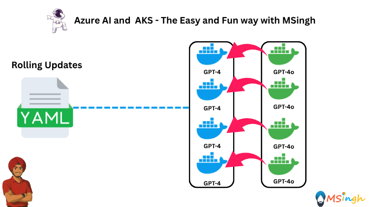
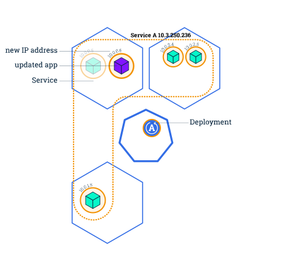

## Rolling Updates with AKS



### Lab Overview
In this lab, we will explore how to perform rolling updates on an application deployed in Azure Kubernetes Service (AKS). Rolling updates allow you to update your application without downtime by incrementally updating instances of the application.

For this lab, we will be using the application we previously containerized and pushed to Azure Container Registry (ACR) - `aoaichatapp` with `GPT-4` model will form the `v1` of the application which we will update to `v2` with `GPT-4o` model.

There are two main terminologies we will use in this lab:
- **maxSurge**: The maximum number of pods that can be created over the desired number of pods during the update.
- **maxUnavailable**: The maximum number of pods that can be unavailable during the update.

<div style="background-color: #fff; padding: 16px; border-radius: 8px;">



</div>

### Prerequisites
- Make sure you have completed the previous lab - [Canary Deployment](./Assets/Canary_Deployment.md), specifically the lab on deploying the AI application to Azure Container Registry (ACR).

### Creating the Deployment YAML file for Initial Version of the Application
We will first deploy the initial version `v1` of the application with `GPT-4` model backing it.

Create a directory named `manifests` in the `lab6_Deployment_Strategies` folder and create a file named `deployment.yaml` inside it.

```yaml
apiVersion: apps/v1
kind: Deployment
metadata:
  name: aoaichatapp
  labels:
    app: aoaichatapp
spec:
  replicas: 4
  strategy:
    type: RollingUpdate
    rollingUpdate:
      maxSurge: 1
      maxUnavailable: 1
  selector:
    matchLabels:
      app: aoaichatapp
  template:
    metadata:
      labels:
        app: aoaichatapp
    spec:
      containers:
      - name: aoaichatapp
        image: $ACR_NAME.azurecr.io/aoaichatapp:v1
        ports:
        - containerPort: 5000
```

Now apply the deployment YAML file to your AKS cluster:
```bash
kubectl apply -f manifests/deployment.yaml
```

Run the following command to expose the applications using a Service resource:
```bash
kubectl expose deploy/aoaichatapp --selector app=aoaichatapp --name mynginx --type LoadBalancer
```

Run the following command to get the Service resource and see the details.
```bash
kubectl get svc mynginx
```

Wait until the `EXTERNAL-IP` is assigned. This may take a few minutes.

Once the `EXTERNAL-IP` is assigned, you can run the following command to port-forward the Service resource to your local machine.
```bash
echo "http://$(kubectl get svc mynginx --output jsonpath='{.status.loadBalancer.ingress[0].ip}')"
```

Running the following `CMD` HTTP request should now return the response from `GPT-4` model:
```CMD
curl -X POST http://<EXTERNAL-IP>:5000/chat -H "Content-Type: application/json" -d "{\"message\":\"hi\"}"
```

### Updating the Application to Version 2
Now that we have the initial version of the application running, we can update it to version `v2` with the `GPT-4o` model.

Modify the `deployment.yaml` file to update the image to `v2`:
```yaml
apiVersion: apps/v1
kind: Deployment
metadata:
  name: aoaichatapp
  labels:
    app: aoaichatapp
spec:
  replicas: 4
  strategy:
    type: RollingUpdate
    rollingUpdate:
      maxSurge: 1
      maxUnavailable: 1
  selector:
    matchLabels:
      app: aoaichatapp
  template:
    metadata:
      labels:
        app: aoaichatapp
    spec:
      containers:
      - name: aoaichatapp
        image: $ACR_NAME.azurecr.io/aoaichatapp:v2
        ports:
        - containerPort: 5000
```

Now apply the updated deployment YAML file to your AKS cluster:
```bash
kubectl apply -f manifests/deployment.yaml
```

### Verifying the Rolling Update
To verify that the rolling update is happening, you can check the status of the pods:
```bash
kubectl get pods -l app=aoaichatapp
```
You should see that the pods are being updated one by one, with some pods running the old version and some running the new version.

Running the CMD HTTP request again should now return the response from the `GPT-4o` model:
```CMD
curl -X POST http://<EXTERNAL-IP>:5000/chat -H "Content-Type: application/json" -d "{\"message\":\"hi\"}"
```

Run the following command to see the history of the Deployment.
```bash
kubectl rollout history deployment/aoaichatapp
```

To rollback to a previous version of the Deployment, you can run the kubectl rollout undo command and rollback to the previous revision or a specific revision if you specify the revision number using the --to-revision flag.

Let's rollback to the previous revision.
```bash
kubectl rollout undo deployment/aoaichatapp
```

To check the status of the rollback, you can run:
```bash
kubectl get pods -l app=aoaichatapp
```
You should see that the pods are now running the previous version of the application.

Running the CMD HTTP request again should now return the response from the `GPT-4` model:
```CMD
curl -X POST http://<EXTERNAL-IP>:5000/chat -H "Content-Type: application/json" -d "{\"message\":\"hi\"}"
```

