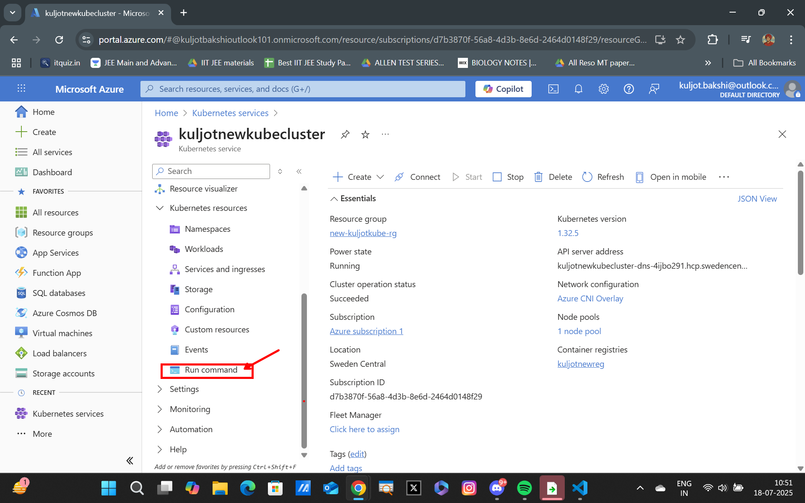
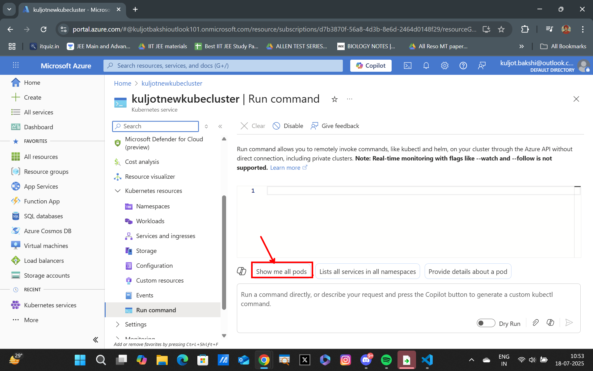
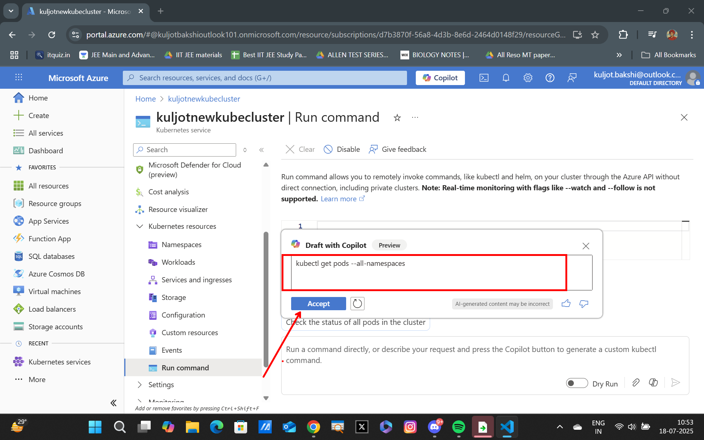
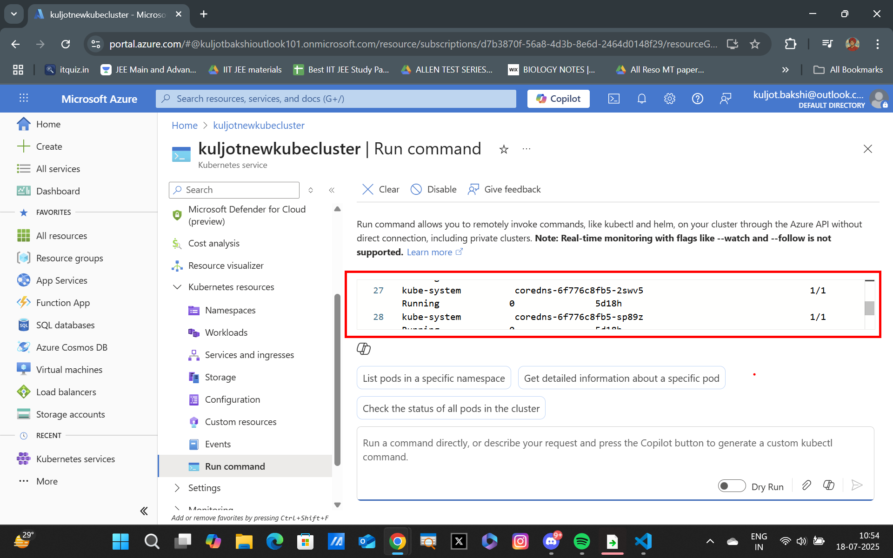
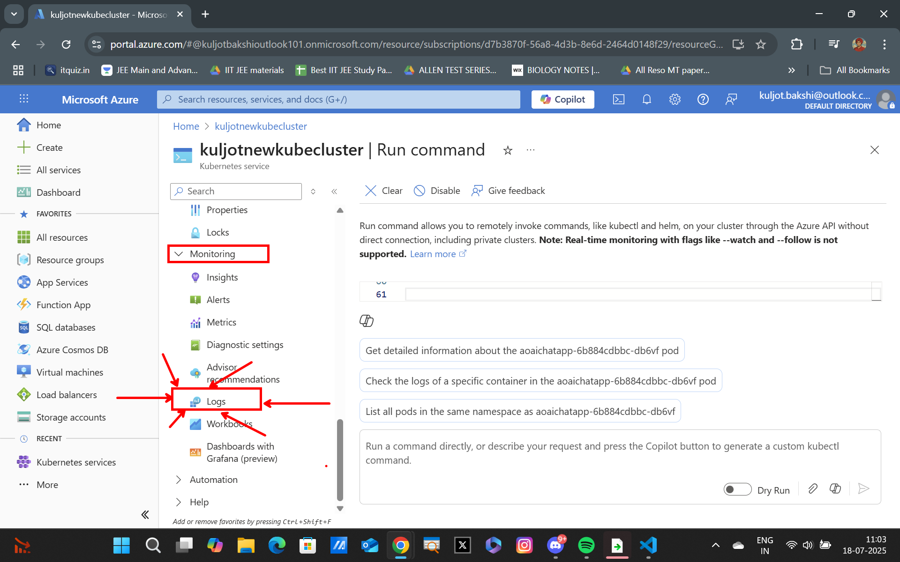
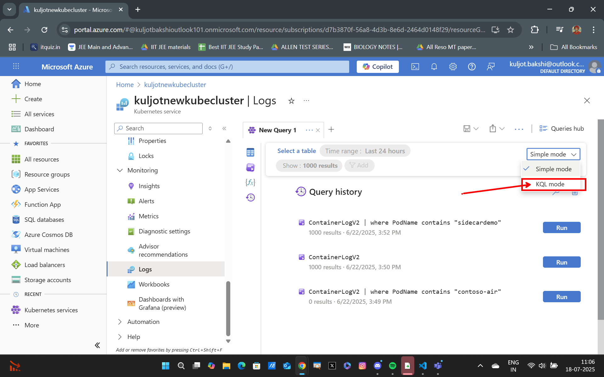
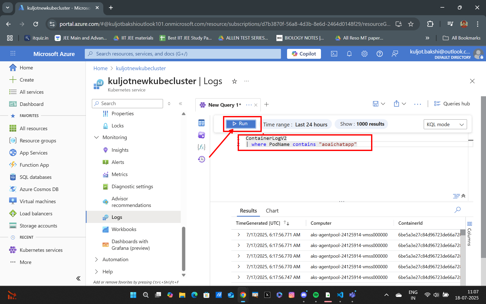
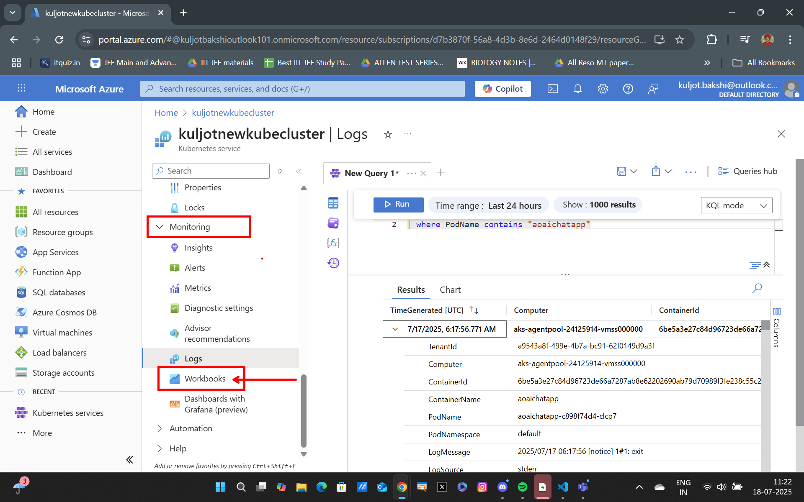

## Copilot Workbooks and Logs for Observability and Maintenance in AKS

### Note
To perform this lab, you need to have pods running in your AKS cluster. If you don't have any pods, you can create any of the deployments from the previous labs. For this demonstration, I will be using the `aoaichatapp` deployment from [Lab 6](../lab6_Deployment_Strategies/Rolling_Updates.md).

### Use built-in CLI tools to monitor Kubernetes applications
Throughout this workshop/course, you've been running the `kubectl CLI commands` on your local machine to interact with the Kubernetes API server. You can also use the <strong>Run command</strong> feature in the AKS portal to run `kubectl` commands directly in the AKS cluster. In fact, you can even use the Microsoft Copilot in Azure feature to help you write the commands.

Open a new browser tab and navigate to your AKS resource.

In the left-hand menu, click on Run command.



In the Run command window, click on one of the Copilot suggestions to run the command.


---

---


You can try a couple of these queries:
```simple
- Show me all pods running in the <deployment_name> deployment
- Show me all the containers running in the <pod_name> pod
- Show me the logs for the <pod_name> pod
```

### Utilize Container Logs
To view the logs of a container, you can use the `kubectl logs` command. This command will output the logs of the container in the terminal. If a Pod has multiple containers, you can specify the container name using the `-c` flag.

In the bash shell or the Azure portal Cloud Shell Session, run the following command to view the logs of the `aoaichatapp` pod:

```bash
# get the name of the aoaichatapp pod
POD_NAME=$(kubectl get po -l app=aoaichatapp --output jsonpath='{.items[0].metadata.name}')

# view the logs of the aoaichatapp pod
kubectl logs $POD_NAME
```

This method of viewing logs is useful for quickly checking the logs of a container. However, the logs are not persisted and will be lost if the Pod is deleted. This is where Azure Container Insights comes in.

With Azure Container Insights, container logs are persisted to Azure Log Analytics workspace which allows you to query and analyze the logs even after the Pod is deleted using Kusto Query Language (KQL).

In the <strong>AKS portal</strong>, click on the Logs menu under the Monitoring section to view the logs of the AKS cluster.



Close the `Welcome to Azure Monitor` window and the `Queries Hub` if they appear. In the query editor, make sure the mode dropdown is set to `KQL mode` then run the following query to view the logs of the AKS cluster.



```kql
ContainerLogV2
| where PodName contains "aoaichatapp"
```



This will show you the logs of all the containers in the AKS cluster. You can use the KQL query editor to filter and analyze the logs.

### Utilizing Workbooks for Monitoring and Maintenance
In the AKS portal, click on the Workbooks menu item under the Monitoring section.



