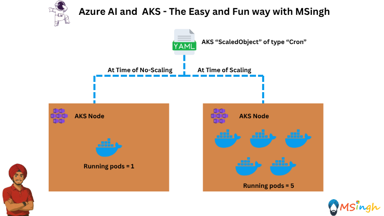

## KEDA on AKS with Cron Scaled Object



### Overview
KEDA (Kubernetes Event-driven Autoscaling) allows you to scale your applications based on various event sources. One of the features KEDA provides is the ability to scale applications based on a cron schedule using a Cron Scaled Object.

### Cron Scaled Object
A Cron Scaled Object is a KEDA resource that allows you to define a schedule for scaling your application. It uses the standard cron syntax to specify when the scaling should occur.

### Setting up Export Variables in our Bash Session
We will set up some environment variables to use in our commands. Open your terminal and run the following commands:

```bash
export ACR_NAME=<your_acr_name>
export AKS_NAME=<your_aks_name>
export RESOURCE_GROUP=<your_resource_group>
```

### Enabling KEDA add-on on an existing AKS cluster

You can update an existing AKS cluster using the `az aks update` command and enable the KEDA add-on using ``--enable-keda` flag.
```bash
az aks update --resource-group $RESOURCE_GROUP --name $AKS_NAME --enable-keda
```

You can verify the KEDA add-on is installed on your cluster using the az aks show command and then set the `--query` parameter to `workloadAutoScalerProfile.keda.enabled`.
```bash
az aks show --resource-group $RESOURCE_GROUP --name $AKS_NAME --query "workloadAutoScalerProfile.keda.enabled"
```

The following example output shows the KEDA add-on is installed on the cluster:
```bash
true
```

### Verify KEDA is running on your AKS Cluster
Verify the KEDA add-on is running on your cluster using the `kubectl get pods` command.
```bash
kubectl get pods -n kube-system
```

The following example output shows the KEDA operator, admissions hook, and metrics API server are installed on the cluster:
```bash
keda-admission-webhooks-**********-2n9zl           1/1     Running   0            3d18h
keda-admission-webhooks-**********-69dkg           1/1     Running   0            3d18h
keda-operator-*********-4hb5n                      1/1     Running   0            3d18h
keda-operator-*********-pckpx                      1/1     Running   0            3d18h
keda-operator-metrics-apiserver-**********-gqg4s   1/1     Running   0            3d18h
keda-operator-metrics-apiserver-**********-trfcb   1/1     Running   0            3d18h
```

#### Verify the KEDA version on your cluster
To verify the version of your KEDA, use `kubectl get crd/scaledobjects.keda.sh -o yaml`. For example:
```bash
kubectl get crd/scaledobjects.keda.sh -o yaml
```

The following example output shows the configuration of KEDA in the app.kubernetes.io/version label:
```yaml
apiVersion: apiextensions.k8s.io/v1
kind: CustomResourceDefinition
metadata:
  annotations:
    controller-gen.kubebuilder.io/version: v0.9.0
    meta.helm.sh/release-name: aks-managed-keda
    meta.helm.sh/release-namespace: kube-system
  creationTimestamp: "2023-08-09T15:58:56Z"
  generation: 1
  labels:
    app.kubernetes.io/component: operator
    app.kubernetes.io/managed-by: Helm
    app.kubernetes.io/name: keda-operator
    app.kubernetes.io/part-of: keda-operator
    app.kubernetes.io/version: 2.10.1
    helm.toolkit.fluxcd.io/name: keda-adapter-helmrelease
    helm.toolkit.fluxcd.io/namespace: 64d3b6fd3365790001260647
  name: scaledobjects.keda.sh
  resourceVersion: "1421"
  uid: 29109c8c-638a-4bf5-ac1b-c28ad9aa11fa
spec:
  conversion:
    strategy: None
  group: keda.sh
  names:
    kind: ScaledObject
    listKind: ScaledObjectList
    plural: scaledobjects
    shortNames:
    - so
    singular: scaledobject
  scope: Namespaced
  # Redacted due to length
```

### Creating a Deployment
We will need to firstly create a workload object of type `Deployment` to scale with KEDA in AKS. We will create a deployment for a simple Azure OpenAI Python Flask app that is contained in the `lab8_KEDA_on_AKS/gpt4_app` folder.

Fill in the environment variables in the `.env` file located in the `lab8_KEDA_on_AKS/gpt4_app` folder with your Azure OpenAI API URL, API Key and Azure Model Name. You can find these values in the Azure portal under your Azure AI Foundry resource.

Then we will build the image and push it to the Azure Container Registry (ACR) using the following commands:

```bash
docker build -t aoaichatapp .
```

```bash
az acr login --name $ACR_NAME
docker tag aoaichatapp $ACR_NAME.azurecr.io/aoaichatapp:latest
docker push $ACR_NAME.azurecr.io/aoaichatapp:latest
```

### Deploying the Application
Now we will deploy our GPT4 application to the AKS cluster as a Kubernetes Deployment. Create a folder named `manifests` in the `lab8_KEDA_on_AKS/gpt4_app` directory and create a file named `gpt4-deployment.yaml` inside it with the following content:

```yaml
apiVersion: apps/v1
kind: Deployment
metadata:
  creationTimestamp: null
  name: gpt4-deployment
spec:
  replicas: 1
  selector:
    matchLabels:
      app: aoaichatapp
  template:
    metadata:
      creationTimestamp: null
      labels:
        app: aoaichatapp
    spec:
      containers:
      - image: $ACR_NAME.azurecr.io/aoaichatapp:latest
        name: aoaichatapp
        ports:
        - containerPort: 5000
```

Now apply the deployment YAML file to your AKS cluster:
```bash
kubectl apply -f manifests/gpt4-deployment.yaml
```

Check the status of the deployment:
```bash
kubectl get deployments
```

Check the status of the pods:
```bash
kubectl get pods
```

You can port forward the application to your local machine to test it:
```bash
kubectl port-forward deployment/gpt4-deployment 5000:5000
```

You can now access the application at `http://localhost:5000` in your web browser.

Test your application by sending a request to the `/chat` endpoint. You can use `curl` or Postman to send a POST request with a JSON body containing your chat message.
```bash
curl -X POST http://localhost:5000/chat -H "Content-Type: application/json" -d "{\"message\":\"hi\"}"
```

### Creating a Cron Scaled Object (HPA - Horizontal Pod Autoscaler)
Create a file named `cron_scaled_object_hpa.yaml` in the `manifests` folder with the following content:

```yaml
apiVersion: keda.sh/v1alpha1
kind: ScaledObject
metadata:
  name: aoai-deployment
  namespace: default
spec:
  scaleTargetRef:
    apiVersion:    apps/v1        
    kind:          Deployment     
    name:          gpt4-deployment               
  minReplicaCount:  1                 
  maxReplicaCount:  5                   
  triggers:
  - type: cron
    metadata:
      # Required
      timezone: Asia/Kolkata  # The acceptable values would be a value from the IANA Time Zone Database.
      start: 30 * * * *       # Every hour on the 30th minute <minute> <hour> <day-of-month> <month> <day-of-week>
      end: 45 * * * *         # Every hour on the 45th minute <minute> <hour> <day-of-month> <month> <day-of-week>
      desiredReplicas: "5"
  - type: cron
    metadata:
      timezone: Asia/Kolkata
      start: 46 * * * *
      end: 29 * * * *
      desiredReplicas: "1"
```

>**Note:** The `start` and `end` fields define the time range during which the scaling will occur. In this case, the scaling will happen every hour between the 30th and 45th minute. You can adjust the `timezone`, `start`, and `end` fields according to your requirements.

Lets now create the ScaledObject using the below command:
```bash
kubectl apply -f manifests/cron_scaled_object_hpa.yaml
```

### Testing Auto-Scaling with EventScaler
You can check the status of the ScaledObject using the following command:
```bash
kubectl get scaledobjects
```

Use the following command to list the scaled pods
```bash
kubectl get pods
```

>**Note**: The pods will scale up to a maximum of 5 replicas during the specified time range and scale down to 1 replica outside this time range. You can change the time range in the `cron_scaled_object_hpa.yaml` file to test different scaling scenarios. Even though the time ranges would change, the scaling logic still remains the same.

You can also check the logs of the KEDA operator to see if it is processing the ScaledObject correctly:
```bash
kubectl logs -f <name-of-the-keda-pod> -n keda --tail=100
```


