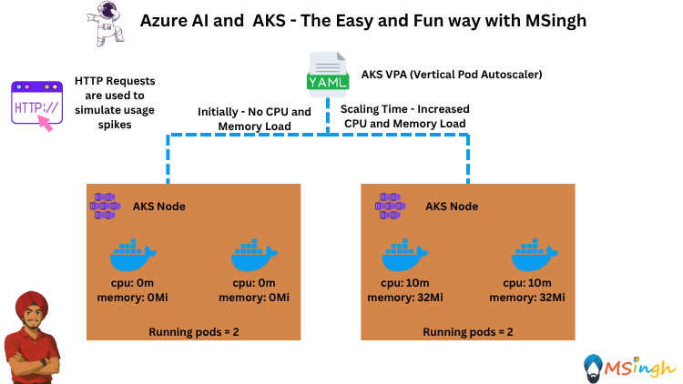

## Vertical Pod Autoscaler (VPA) in AKS



### Overview
The Vertical Pod Autoscaler (VPA) automatically adjusts the CPU and memory requests and limits for
containers in your Kubernetes cluster based on historical usage data. This helps ensure that your applications have the right resources allocated to them, improving performance and resource utilization.

### Prerequisites
Make sure that you are done with the [Cron Scaled Object](./cron_scaled_object.md) lab before proceeding with this lab. We will be using the same application and environment variables.

### Installing VPA on AKS
Run the following commands to install the VPA CRDs and controllers onto your AKS cluster:
```bash
# Install the CRDs
kubectl apply -f https://github.com/kubernetes/autoscaler/releases/download/vertical-pod-autoscaler-0.13.0/vpa-v1-crd.yaml

# Install the VPA components (recommender, updater, admission-controller)
kubectl apply -f https://github.com/kubernetes/autoscaler/releases/download/vertical-pod-autoscaler-0.13.0/vpa.yaml
```

You can verify your installation with the following command:
```bash
kubectl get pods -n kube-system | grep vpa
```

You should see:
```bash
vpa-admission-controller-xxxxx
vpa-recommender-xxxxx
vpa-updater-xxxxx
```

>**Note**:You can also go to your AKS cluster in the Azure portal and check the `Custom Resources` section to see the VPA CRDs. This would verify that the VPA is installed correctly.

### Creating a new deployment for VPA
Create a file named `gpt4-deployment.yaml` in the `manifests` folder with the following content:
```yaml
apiVersion: apps/v1
kind: Deployment
metadata:
  name: gpt4-deployment
  labels:
    app: aoaichatapp
spec:
  replicas: 2
  selector:
    matchLabels:
      app: aoaichatapp
  template:
    metadata:
      labels:
        app: aoaichatapp
    spec:
      containers:
      - name: aoaichatapp
        image: $ACR_NAME.azurecr.io/aoaichatapp:latest
        ports:
        - containerPort: 5000
        # No resources section so VPA will fill them in automatically
        resources: {}
```

Now apply the deployment YAML file to your AKS cluster:
```bash
kubectl apply -f manifests/gpt4-deployment.yaml
```

Verify the pods are running:
```bash
kubectl get pods
```

Make note of the pod names as you will need them later. These pods will change their resource requests and limits based on the VPA recommendations. You will see that to your surprise, the pods names will entirely change after the VPA has made its recommendations. This would mean that the VPA terminates the pods and creates new ones with the updated resource requests and limits.

### Creating a VPA for the Deployment
In the same `manifests` folder, create a file named `gpt4-vpa.yaml` with the following content:
```yaml
apiVersion: autoscaling.k8s.io/v1
kind: VerticalPodAutoscaler
metadata:
  name: vpa-chat
  namespace: default
spec:
  targetRef:
    apiVersion: "apps/v1"
    kind: Deployment
    name: gpt4-deployment
  updatePolicy:
    updateMode: "Auto"  # Let VPA evict pods automatically
  resourcePolicy:
    containerPolicies:
    - containerName: "*"
      minAllowed:
        cpu: 10m
        memory: 32Mi
      maxAllowed:
        cpu: "2"
        memory: 2Gi
```

Apply the VPA configuration:
```bash
kubectl apply -f manifests/gpt4-vpa.yaml
```

Check the status of the VPA:
```bash
kubectl get vpa
```

### Simulating Load and Seeing VPA in Action
To simulate load on the application and a usage spike that would trigger the VPA, you can use a simple `CURL` script to send a request to the `/stress` endpoint of your application. This endpoint is already implemented in your application to handle stress testing.

first, port forward the deployment to your local machine:
```bash
kubectl port-forward deployment/gpt4-deployment 5000:5000
```

Now, in a new terminal, run the following command to simulate load:
```bash
while true; do
  for i in {1..50}; do
    curl -s http://localhost:5000/stress &
  done
  wait  # Wait for all 50 requests to finish before looping again
done
```

This will continuously send requests to the `/stress` endpoint, simulating a load on your application.

After a few minutes, you should see that the VPA has updated the resource requests and limits for the pods. You will also notice that the pods have been restarted with new names, reflecting the updated resource configurations.
```bash
kubectl get pods
```

You could also check the VPA recommendations:
```bash
kubectl get vpa vpa-chat -o yaml
```

Observe the `target` key in the `recommendation` object, which will show the recommended CPU and memory requests and limits for the containers in the deployment. This is the result of the VPA's analysis of the resource usage patterns of your application and these are the values with which the new pods have been created.

```bash
# Output truncated for brevity
recommendation:
    containerRecommendations:
    - containerName: aoaichatapp
      lowerBound:
        cpu: 10m
        memory: "61678247"
      target:
        cpu: 23m
        memory: "163378051"
      uncappedTarget:
        cpu: 23m
        memory: "163378051"
      upperBound:
        cpu: "2"
        memory: 2Gi
```

You can also check the logs of the `vpa-updater` pod to see the VPA's actions:
```bash
kubectl -n kube-system logs deployment/vpa-updater
```

You will notice logs indicating that the VPA has updated the deployment and restarted the pods with new resource requests and limits. Now the requests are within limits that the VPA has recommended based on the load you simulated.
```bash
# Output truncated for brevity
0801 19:33:54.200334       1 update_priority_calculator.go:132] not updating a short-lived pod default/gpt4-deployment-58474fb4c5-5g8vg, request within recommended range
I0801 19:33:54.200368       1 update_priority_calculator.go:132] not updating a short-lived pod default/gpt4-deployment-58474fb4c5-rxp4n, request within recommended range
```


