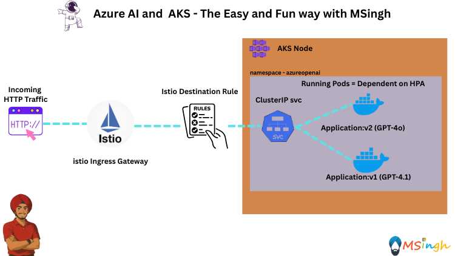
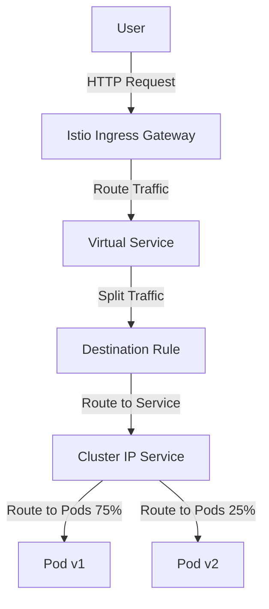

## Canary Deployment Strategy with Istio Service Mesh in AKS



### Lab Overview
In this lab, you will learn how to implement a canary deployment strategy using Istio Service Mesh in Azure Kubernetes Service (AKS). You will gain hands-on experience in managing traffic between different versions of your application, allowing you to test new features with a subset of users before a full rollout.

### Prerequisites
Make sure you are done with both these labs prior to starting this one:
1. [mTLS Encryption with Istio](./istio_encryption_mTLS.md)
2. [Ingress Gateway with Istio](./istio_ingress_gateway.md)

### Setting Export Variables
We will set some export variables in our bash session for usage in some scripts later on:
```bash
export RG_NAME=""
export AKS_CLUSTER=""
export ACR_NAME="" 
export AZURE_OPENAI_ENDPOINT=""
export AZURE_API_KEY=""
export AZURE_MODEL_NAME_v1="" # model for usage in version 1 of the application 
export AZURE_MODEL_NAME_v2="" # model for usage in version 2 of the application
```

### Building and Pushing Application Image to ACR
Begin by logging into your ACR (Azure Container Registry)
```bash
az acr login --name $ACR_NAME
```

Make sure you are in the `lab9_Istio_Service_Mesh/ChatBackend` directory and run the following command to create an image of our application:
```bash
docker build . -t canarydeploymentapplication:latest
```

Next, tag the `canarydeploymentapplication` image with your ACR name:
```bash
docker tag canarydeploymentapplication:latest $ACR_NAME.azurecr.io/canarydeploymentapplication:latest
```

Finally, push the backend image to your ACR:
```bash
docker push $ACR_NAME.azurecr.io/canarydeploymentapplication:latest
```

### Creating ConfigMaps
We will be creating two separate `ConfigMaps`:
 - a) One for the v1 version of the application: Will have the `AZURE_MODEL_NAME` environment variable set to `gpt-4.1`
 - b) One for the v2 version of the application: Will have the `AZURE_MODEL_NAME` environment variable set to `gpt-4o`

Run the following command to create the `v1` ConfigMap:
```bash
kubectl create configmap chatbackend-configs-v1 -n azureopenai \
--from-literal=AZURE_API_URL=$AZURE_OPENAI_ENDPOINT \
--from-literal=AZURE_API_KEY=$AZURE_API_KEY \
--from-literal=AZURE_MODEL_NAME=$AZURE_MODEL_NAME_v1
```

Run the following command to create the `v2` ConfigMap:
```bash
kubectl create configmap chatbackend-configs-v2 -n azureopenai \
--from-literal=AZURE_API_URL=$AZURE_OPENAI_ENDPOINT \
--from-literal=AZURE_API_KEY=$AZURE_API_KEY \
--from-literal=AZURE_MODEL_NAME=$AZURE_MODEL_NAME_v2
```

### Deploying Both the Versions of our Application
We will now be deploying both the versions : `v1` and `v2` of our application to AKS.

Create a file named `v1-deployment.yaml` for deploying the version 1 of the application with the following content:
```bash
apiVersion: apps/v1
kind: Deployment
metadata:
  name: azureopenaichat-v1
  namespace: azureopenai
spec:
  replicas: 1
  selector:
    matchLabels:
      app: azureopenaichat
  template:
    metadata:
      labels:
        app: azureopenaichat
        version: v1
    spec:
      containers:
        - name: azureopenaichat-v1
          image: $ACR_NAME.azurecr.io/canarydeploymentapplication:latest
          ports:
            - containerPort: 5000
          envFrom:
            - configMapRef:
                name: chatbackend-configs-v1
```

Apply the deployment to your AKS cluster with the following command:
```bash
kubectl apply -f v1-deployment.yaml
```

Now create a new file named `v2-deployment.yaml` in the `manifests` folder with the following content:
```bash
apiVersion: apps/v1
kind: Deployment
metadata:
  name: azureopenaichat-v2
  namespace: azureopenai
spec:
  replicas: 1
  selector:
    matchLabels:
      app: azureopenaichat
  template:
    metadata:
      labels:
        app: azureopenaichat
        version: v2
    spec:
      containers:
        - name: azureopenaichat-v2
          image: $ACR_NAME.azurecr.io/canarydeploymentapplication:latest
          ports:
            - containerPort: 5000
          envFrom:
            - configMapRef:
                name: chatbackend-configs-v2
```

Now, apply the deployment to your AKS cluster:
```bash
kubectl apply -f v2-deployment.yaml
```

### Creating a ClusterIP Service 
We will now be creating a `ClusterIP` service to expose the `azureopenaichat` application. Both the versions `v1` and `v2` of the application will be put behind the `ClusterIP`service as both are labelled `azureopenaichat` (the the deployment yaml definitions for both).

Create a file named `azureopenaichat-service.yaml` with the following content:
```bash
apiVersion: v1
kind: Service
metadata:
  name: azureopenaichat-service
  namespace: azureopenai
spec:
  selector:
    app: azureopenaichat
  type: ClusterIP
  ports:
    - protocol: TCP
      port: 5000
      targetPort: 5000
```

### Creating an Istio Managed Virtual Service for Weight Based Routing
We will now be creating an `istio` managed virtual service to route traffic between the two versions of our application based on weights. We will route `75%` of the traffic to the `v1` of the application and `25%` of the traffic to the `v2` of the application.

Create a file named `azureopenaichat-virtualservice.yaml` in the `manifests` folder with the following content:
```bash
apiVersion: networking.istio.io/v1alpha3
kind: VirtualService
metadata:
  name: azureopenaivirtualservice
  namespace: azureopenai
spec:
  hosts:
    - "*"                        # match any Host header accepted by the Gateway
  gateways:
    - azureopenaichat-gateway
  http:
    - match:
        - uri:
            prefix: /            # match all paths
      route:
        - destination:
            host: azureopenaichat-service.azureopenai.svc.cluster.local
            subset: v1
          weight: 75
        - destination:
            host: azureopenaichat-service.azureopenai.svc.cluster.local
            subset: v2
          weight: 25

```

Apply the configuration with the following command:
```bash
kubectl apply -f azureopenaichat-virtualservice.yaml
```

### Creating a Destination Rule for the Subset Routing

#### <strong> What is a Destination Rule </strong>
A DestinationRule in Istio is basically the “post-office sorting instructions” for traffic after a VirtualService decides where to send it.

#### <strong> How Destination Rule works with a Virtual Service? </strong>
- <strong>VirtualService</strong> → decides which host traffic goes to and splits it among subsets.
- <strong>DestinationRule</strong> → defines what those subsets are and how to handle traffic once it reaches that host.

Create a file named `azureopenaichat-destinationrule.yaml` in the `manifests` folder with the following content:
```bash
apiVersion: networking.istio.io/v1alpha3
kind: DestinationRule
metadata:
  name: azureopenaichat-destinationrule
  namespace: azureopenai
spec:
  host: azureopenaichat-service
  subsets:
  - name: v1
    labels:
      version: v1
  - name: v2
    labels:
      version: v2
```

Now, apply the Destination Rule to your AKS cluster:
```bash
kubectl apply -f azureopenaichat-destinationrule.yaml
```

### Creating an Istio External Ingress Gateway
We will now be creating an Istio External Ingress Gateway that routes incoming traffic to our `azureopenaichat` application.

The overall flow will look something like this:


Create a file named `istio-external-ingress.yaml` in the `manifests` folder with the following content:
```yaml
apiVersion: networking.istio.io/v1alpha3
kind: Gateway
metadata:
  name: azureopenaichat-gateway
  namespace: azureopenai
spec:
  selector:
    istio: aks-istio-ingressgateway-external
  servers:
  - port:
      number: 80
      name: http
      protocol: HTTP
    hosts:
    - "*"
```

Now apply the virtual service to the AKS cluster:
```bash
kubectl apply -f manifests/istio-external-ingress.yaml
```

### Fetching the External IP for the Ingress Gateway
The `azureopenaichat-gateway` will have an external IP address which could be publicly accessed over the internet, thus giving access to the `azureopenaichat` application.

Run the following command to fetch the external IP address of the `azureopenaichat-gateway`:
```bash
kubectl get svc aks-istio-ingressgateway-external -n aks-istio-ingress 
```

The output will look something like this:
```bash
NAME                                TYPE           CLUSTER-IP     EXTERNAL-IP      PORT(S)                                      AGE
aks-istio-ingressgateway-external   LoadBalancer   172.16.0.128   131.145.32.126   15021:32312/TCP,80:30483/TCP,443:32303/TCP   5m5s
```

### Autoscaling the Deployments
Because we don’t need to maintain replica ratios anymore, we can safely add Kubernetes horizontal pod autoscalers to manage the replicas for both version Deployments:
```bash
kubectl autoscale deployment azureopenaichat-v1 --cpu-percent=50 --min=1 --max=10 -n azureopenai
kubectl autoscale deployment azureopenaichat-v2 --cpu-percent=50 --min=1 --max=10 -n azureopenai
```

>**Note**: Keep in mind the autoscaling is only done so that we can efficiently manage the resources based on the traffic patterns and load on the application. It has nothing to do with having an influence on the traffic splitting or routing decisions made by Istio as the autoscaler operates independently of the service mesh layer. The splitting decisions are made by Istio's Destination Rules and Virtual Services which operate independently of the deployment-ratio.

### Testing the Canary Deployment Setup
we will test by running CURL requests to the service. You can use curl or any HTTP client to send requests to the service URL obtained from the previous command. Open CMD and run the following command to test the service:

```bash
curl -X POST http://<EXTERNAL-IP>/chat -H "Content-Type: application/json" -d "{\"message\":\"hi\"}"
```

You could also run this python script to call the endpoint 20 times and then count how many of them were returned by `v1` and how many of them by `v2`
```python
import requests
import json
from collections import Counter
import time

# Replace with your actual external IP and port
URL = "http://<EXTERNAL-IP>/chat"

counts = Counter()

for i in range(20):
    try:
        resp = requests.post(URL, json={"message": "hi"}, timeout=10)
        data = resp.json()
        model = data.get("model", "unknown")

        # Group models by main family ignoring date suffix
        if model.startswith("gpt-4.1"):
            counts["gpt-4.1"] += 1
        elif model.startswith("gpt-4o"):
            counts["gpt-4o"] += 1
        else:
            counts["other"] += 1

        print(f"{i+1}. {model}")

    except Exception as e:
        counts["error"] += 1
        print(f"{i+1}. Error: {e}")

    time.sleep(0.1)  # small pause to avoid overwhelming server

print("\n=== Final Counts ===")
for model_name, count in counts.items():
    print(f"{model_name}: {count}")
```

In the outputs notice the model used for the response. You should see responses from both the GPT-4.1 and GPT-4o Chat applications, indicating that the canary deployment is working as expected. 25% of the traffic is routed to the GPT-4o Chat application, and 75% of the traffic is routed to the GPT-4.1 Chat application.

