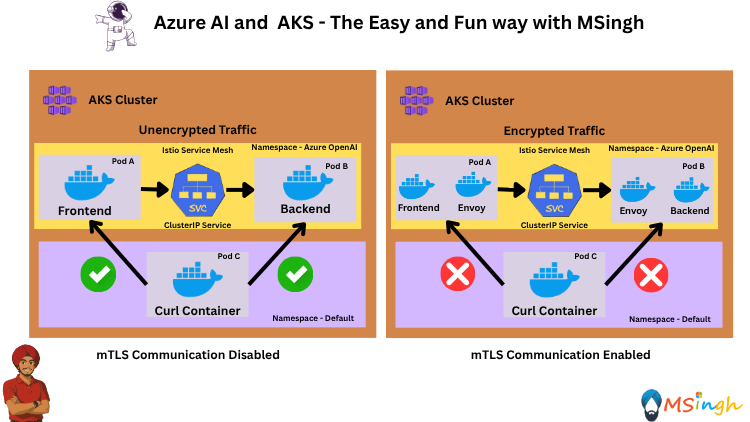
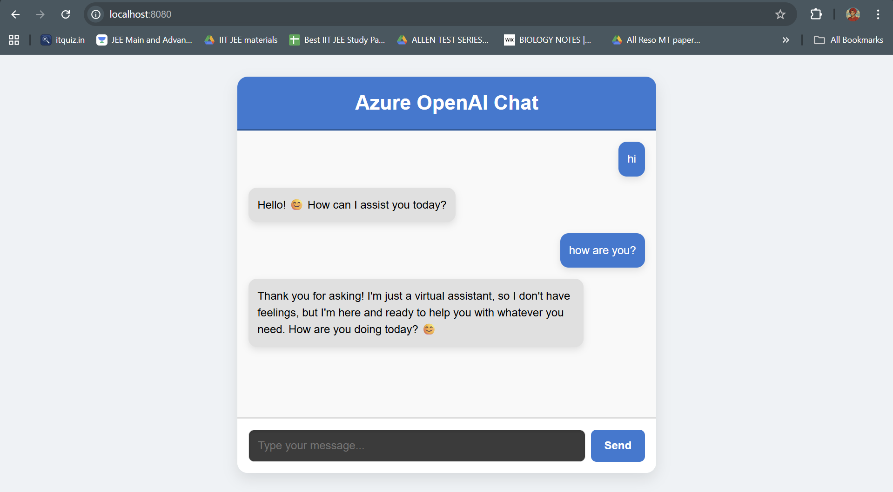

## mTLS (Mutual TLS) encryption in Istio


### Overview
Istio is an open-source service mesh that layers transparently onto existing distributed applications. Istio’s powerful features provide a uniform and more efficient way to secure, connect, and monitor services. Istio enables load balancing, service-to-service authentication, and monitoring – with few or no service code changes.

In this lab, we will explore how to implement mTLS (Mutual TLS) encryption in Istio to secure communication between services.

### Setting Export Variables
Set the following export variables in your Bash terminal:
```bash
export AKS_CLUSTER_NAME=""
export ACR_NAME=""
export RESOURCE_GROUP=""
export AZURE_API_URL=""
export AZURE_API_KEY=""
export AZURE_MODEL_NAME=""
```

### Install Mesh for Existing Cluster
Execute the following command to enable the Istio add-on for your existing AKS cluster
```bash
az aks mesh enable --resource-group ${RESOURCE_GROUP} --name ${AKS_CLUSTER_NAME}
```

To verify the installation, you can use the following command:
```bash
az aks show --resource-group ${RESOURCE_GROUP} --name ${AKS_CLUSTER_NAME}  --query 'serviceMeshProfile.mode'
```

You can also see the Istio components running in the `aks-istio-system` namespace:
```bash
kubectl get pods -n aks-istio-system
```

### Create a new Namespace
We will be creating a new namespace and naming that as `azureopenai`. We will be deploying both the frontend and backend containerised workloads of our application in this namespace and you guessed it right! We will also be creating an Istio Service Mesh with Sidecar injection in this namespace. 

```bash
kubectl create namespace azureopenai
```

### Enabling Sidecar Injection
To automatically install sidecar to any new pods, you need to annotate your namespaces with the revision label corresponding to the control plane revision currently installed.

check the revision label for your AKS cluster with the following command:
```bash
az aks show --resource-group ${RESOURCE_GROUP} --name ${AKS_CLUSTER_NAME}  --query 'serviceMeshProfile.istio.revisions'
```

Now, apply the revision label to the `azureopenai` namespace:
```bash
kubectl label namespace azureopenai istio.io/rev=asm-X-Y
```

>**Note**: The `rev=asm-X-Y` should be replaced with the actual revision label obtained from the previous command. Example:
    ```bash
    kubectl label namespace default istio.io/rev=asm-1-24
    ```

### Deploying our Backend in the azureopenai Namespace

Build your backend's docker image and push to ACR.
```bash
docker build . -t chatbackend:latest
```

Login to your ACR
```bash
az acr login --name $ACR_NAME
```

Next, tag the backend image with your ACR name:
```bash
docker tag chatbackend:latest $ACR_NAME.azurecr.io/chatbackend:latest
```

Finally, push the backend image to your ACR:
```bash
docker push $ACR_NAME.azurecr.io/chatbackend:latest
```

Create a `ConfigMap` for the backend workload:
```bash
kubectl create configmap chatbackend-configs -n azureopenai \
--from-literal=AZURE_API_URL=$AZURE_OPENAI_ENDPOINT \
--from-literal=AZURE_API_KEY=$AZURE_API_KEY \
--from-literal=AZURE_MODEL_NAME=$AZURE_MODEL_NAME
```

Now that the backend image is in ACR, we can deploy it to Azure Kubernetes Service (AKS). First, create a `manifests` directory in the root folder:
```bash
mkdir manifests
```

Next, create a file named `chatbackend-deployment.yaml` in the `manifests` directory with the following content:
```yaml
apiVersion: apps/v1
kind: Deployment
metadata:
  name: chatbackend
  namespace: azureopenai
spec:
  replicas: 2
  selector:
    matchLabels:
      app: chatbackend
  template:
    metadata:
      labels:
        app: chatbackend
    spec:
      containers:
        - name: chatbackend
          image: $ACR_NAME.azurecr.io/chatbackend:latest
          ports:
            - containerPort: 5000
          envFrom:
            - configMapRef:
                name: chatbackend-configs
```

Now, apply the deployment manifest to your AKS cluster:
```bash
kubectl apply -f manifests/chatbackend-deployment.yaml
```

Verify that the deployment is running:
```bash
kubectl get deployments -n azureopenai
```

Verify the pods are running:
```bash
kubectl get pods -n azureopenai
```

### Exposing the Backend Workload with a ClusterIP Service
We will now be exposing the backend workload with a `clusterIP` service. This service will be used by the envoy containers to communicate with the backend service for the frontend service.

Create a file named `chatbackend-service.yaml` in the `manifests` directory with the following content:
```yaml
apiVersion: v1
kind: Service
metadata:
  name: chatbackend-service
  namespace: azureopenai
spec:
  selector:
    app: chatbackend
  type: ClusterIP
  ports:
    - protocol: TCP
      port: 5000
      targetPort: 5000
```

Now, apply the service manifest to your AKS cluster:
```bash
kubectl apply -f manifests/chatbackend-service.yaml
```

Verify that the service is created:
```bash
kubectl get services -n azureopenai
```

### Deploying our Frontend in the azureopenai Namespace

Build your frontend's docker image and push to ACR.
```bash
docker build . -t chatfrontend:latest
```

Next, tag the frontend image with your ACR name:
```bash
docker tag chatfrontend:latest $ACR_NAME.azurecr.io/chatfrontend:latest
```

Finally, push the frontend image to your ACR:
```bash
docker push $ACR_NAME.azurecr.io/chatfrontend:latest
```

Now create a file named `chatfrontend-deployment.yaml` in the manifests directory with the following content:
```yaml
apiVersion: apps/v1
kind: Deployment
metadata:
  name: chatfrontend
  namespace: azureopenai
spec:
  replicas: 2
  selector:
    matchLabels:
      app: chatfrontend
  template:
    metadata:
      labels:
        app: chatfrontend
    spec:
      containers:
        - name: chatfrontend
          image: $ACR_NAME.azurecr.io/chatfrontend:latest
          ports:
            - containerPort: 80
```

Now, apply the deployment manifest to your AKS cluster:
```bash
kubectl apply -f chatfrontend-deployment.yaml
```

Verify the deployment:
```bash
kubectl get deployments -n azureopenai
```

Verify the pods are running:
```bash
kubectl get pods -n azureopenai
```

### Istio Envoy Containers
All of our deployments were made in the `azureopenai` namespace which means all the pods so provisioned will have `istio-envoy` containers running as `sidecar` containers to the main `frontend` and `backend` containers in the `azureopenai` namespace.

Let's inspect one of the pods and see what containers are running.

Run the following command to retrive all the pods running in the `azureopenai` namespace:
```bash
kubectl get pods -n azureopenai
```

The applications are now part of the Istio mesh and can use its features like traffic management, security, and observability. You can verify that by running a kubectl describe against one of the pods on the `azureopenai` namespace:
```bash
kubectl describe pod <pod-name> -n azureopenai
```

### Secure Communication with mTLS and Peer Authentication

#### Test Communication Before Enforcing mTLS
First, deploy a test pod outside the mesh, in the default namespace, to simulate an external client.

Create a file named `curl-outside.yaml` in the `manifests` folder with the following content:
```yaml
apiVersion: apps/v1
kind: Deployment
metadata:
  name: curl-outside
spec:
  replicas: 1
  selector:
    matchLabels:
      app: curl
  template:
    metadata:
      labels:
        app: curl
    spec:
      containers:
      - name: curl
        image: docker.io/curlimages/curl
        command: ["sleep", "3600"]
```

Apply the deployment manifest to your AKS cluster:
```bash
kubectl apply -f manifests/curl-outside.yaml
```

Verify the deployment:
```bash
kubectl get deployments -n default
```

Verify the pods are running:
```bash
kubectl get pods -n default
```

Once the pod is running, try sending a request to the chat-backend service:
```bash
CURL_OUTSIDE_POD="$(kubectl get pod -l app=curl -o jsonpath="{.items[0].metadata.name}")"
```
```bash
kubectl exec -it ${CURL_OUTSIDE_POD} -- \
  curl -sS -i \
  -H "Content-Type: application/json" \
  -d '{"message":"hello from curl"}' \
  http://chatbackend-service.azureopenai.svc.cluster.local:5000/chat
```

You should get a response back from the `/chat` endpoint which would look something like this:
```json
{"model":"gpt-4o-2024-11-20","reply":"Hello! It looks like you're using `curl` to interact with me. How can I assist you today?"}
```

>**Note**: You should see a HTTP/1.1 200 OK response, meaning the service is accepting unencrypted traffic.

#### Apply PeerAuthentication to Enforce mTLS
Now, enforce strict mTLS for all services in the `azureopenai` namespace:

Create a file named `peer-authentication.yaml` in the `manifests` directory with the following content:
```yaml
apiVersion: security.istio.io/v1
kind: PeerAuthentication
metadata:
  name: azureopenai-mtls
  namespace: azureopenai
spec:
  mtls:
    mode: STRICT
```

Apply the yaml file:
```bash
kubectl apply -f manifests/peer-authentication.yaml
```

#### Test Communication Again
Try sending the same request from the outside test pod:
```bash
kubectl exec -it ${CURL_OUTSIDE_POD} -- \
  curl -sS -i \
  -H "Content-Type: application/json" \
  -d '{"message":"hello from curl"}' \
  http://chatbackend-service.azureopenai.svc.cluster.local:5000/chat
```

The response should indicate that mTLS is now required.
```plain
curl: (56) Recv failure: Connection reset by peer
command terminated with exit code 56
```

>**Note**:This time, the request fails because the chat-backend service now rejects plaintext connections.

### Viewing the frontend

Lets port forward the `chatfrontend` deployment to our local machine:
```bash
kubectl port-forward deployment/chatfrontend 8080:80 -n azureopenai
```

Now you can access the frontend at `http://localhost:8080`.



>**Note**: The frontend is now accessible and can communicate with the backend securely over mTLS since both of them reside in the `azureopenai` namespace which is configured for mTLS by the istio service mesh.


