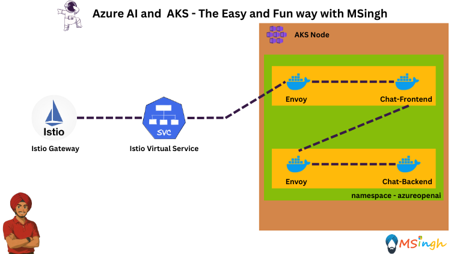
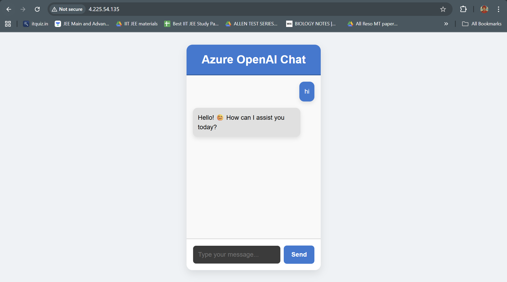

## Istio Ingress Gateway



### Prerequisites
Make sure you are done with [Istio mTLS Encryption](./istio_encryption_mTLS.md) before proceeding with this section. We will be using the same `frontend` and `backend` workloads and the entire setup defined in the [Istio mTLS Encryption](./istio_encryption_mTLS.md) lab.

### Setting Export Variables
Lets quickly set-up some export variables in our bash terminal session for usage in this lab:
```bash
export RG_NAME=<your-resource-group-name>
export AKS_CLUSTER_NAME=<your-aks-cluster-name>
```

### Enabling Istio Ingress Gateway on AKS Cluster
With the usage of the AKS Istio add-on we can easily enable the Istio Ingress Gateway controller, removing the need for manual steps.

Run the following command to enable Istio Ingress Gateway on your cluster:
```bash
az aks mesh enable-ingress-gateway  \
  --resource-group ${RG_NAME} \
  --name ${AKS_CLUSTER_NAME} \
  --ingress-gateway-type external
```

You can check if the istio ingress components are running with the following command:
```bash
kubectl get pods -n aks-istio-ingress
```

>**Note**: If Istio pods are in a Running state, the installation is complete. If they are Pending or CrashLoopBackOff, wait a few minutes and check again

### Defining a ClusterIP Service for our Frontend Workload
We will now be defining a clusterIP service for our `frontend` application which is already running in the `azureopenai` namespace.

Create a file named `frontend-service.yaml` in the `manifests` directory with the following content:
```yaml
apiVersion: v1
kind: Service
metadata:
  name: chatfrontend-service
  namespace: azureopenai
spec:
  selector:
    app: chatfrontend
  type: ClusterIP
  ports:
    - protocol: TCP
      port: 80
      targetPort: 80
```

### Create an Istio Gateway
We’ll define a Gateway resource that listens on HTTP (port 80) and forwards traffic to our `chatfrontend-service`.

Create a file named `chatfrontend-gateway.yaml` in the `manifests` directory with the following content:
```yaml
apiVersion: networking.istio.io/v1alpha3
kind: Gateway
metadata:
  name: chatfrontend-gateway
  namespace: azureopenai
spec:
  selector:
    istio: aks-istio-ingressgateway-external
  servers:
  - port:
      number: 80
      name: http
      protocol: HTTP
    hosts:
    - "*"
```

Now apply the ingress gateway to your AKS cluster in the `azureopenai` namespace:
```bash
kubectl apply -f manifests/chatfrontend-gateway.yaml
```

### Create a Virtual Service To Route Traffic
A Gateway only defines how traffic enters the cluster. We also need a VirtualService to route traffic from the gateway to `chatfrontend-service`

Create a file named `azureopenai-route.yaml` in the `manifests` directory with the following content:
```yaml
apiVersion: networking.istio.io/v1alpha3
kind: VirtualService
metadata:
  name: azureopenai-route
  namespace: azureopenai
spec:
  hosts:
  - "*"
  gateways:
  - chatfrontend-gateway
  http:
  - match:
    - uri:
        prefix: /
    route:
    - destination:
        host: chatfrontend-service
        port:
          number: 80
```

Now apply the virtual service to the AKS cluster:
```bash
kubectl apply -f manifests/azureopenai-route.yaml -n azureopenai
```

### Fetching the External IP for the Ingress Gateway
The `chatfrontend-gateway` will have an external IP address which could be publicly accessed over the internet, thus giving access to the `chatfrontend` application.

Run the following command to fetch the external IP address of the `chatfrontend-gateway`:
```bash
kubectl get svc aks-istio-ingressgateway-external -n aks-istio-ingress 
```

The output will look something like this:
```bash
NAME                                TYPE           CLUSTER-IP     EXTERNAL-IP      PORT(S)                                      AGE
aks-istio-ingressgateway-external   LoadBalancer   172.16.0.128   131.145.32.126   15021:32312/TCP,80:30483/TCP,443:32303/TCP   5m5s
```

Paste the `EXTERNAL-IP` address into your browser to access the `chatfrontend` application.

